---

---

# 1. redis 入门


## 1.1 下载与安装


## 1.2 启动与停止


**设置后台运行：**

在 redis 文件根目录的 redis.conf 中的 daemonize 设为yes

运行时使用该配置文件：/usr/local/redis-4.0.0/src/redis-server ./redis.conf 


**进入服务：**

进入 redis 根目录下的 src 文件，运行 redis-cli 文件


**设置密码：**

在 redis.conf  文件中添加 requirepass 密码


**登录：**


auth  <密码>

或者


-h 域名

-p 端口号

-a 密码


**远程连接：**

在redis.conf  文件中将 bind 127.0.0.1 注释

windows下连接：redis-server redis.windows.conf


## 1.3 redis 数据类型


# 2. redis 常用命令


- **string：**


- **hash：**


- **list：**


lrange list 0 -1 ：从头查到尾


- **set：**


- **sorted set**


- **通用命令**


select <数据库号>

默认配置了16个数据库，可以在 redis.conf 中修改：


# 3. 在 Java 中操作 redis


## 3.1 Jedis 快速入门


```java
package com.itheima.test;

import org.junit.Test;
import redis.clients.jedis.Jedis;

import java.util.Set;

/**
 * 使用Jedis操作Redis
 */
public class JedisTest {

    @Test
    public void testRedis(){
        //1 获取连接
        Jedis jedis = new Jedis("39.106.77.183",6379);

        // 身份验证
        jedis.auth("565034470");

        //2 执行具体的操作
        jedis.set("username","xiaoming");

        String value = jedis.get("username");
        System.out.println(value);

        //jedis.del("username");

        jedis.hset("myhash","addr","bj");
        String hValue = jedis.hget("myhash", "addr");
        System.out.println(hValue);

        Set<String> keys = jedis.keys("*");
        for (String key : keys) {
            System.out.println(key);
        }

        //3 关闭连接
        jedis.close();
    }
}
```


### 3.1.1 Jedis 线程池

Jedis实例是线程不安全的，多线程环境下需要基于连接池使用


jedisPool 初始化参数（设置，地址，端口，超时时间，密码）


## 3.2  Spring Data Redis 

### 3.2.1 简介

 Spring Data Redis 整合了 Jedis 和 letture


### 3.2.2 快速入门


```java
package com.itheima.test;

import org.junit.Test;
import org.junit.runner.RunWith;
import org.springframework.beans.factory.annotation.Autowired;
import org.springframework.boot.test.context.SpringBootTest;
import org.springframework.data.redis.connection.DataType;
import org.springframework.data.redis.core.*;
import org.springframework.test.context.junit4.SpringRunner;

import java.util.List;
import java.util.Set;
import java.util.concurrent.TimeUnit;

@SpringBootTest
@RunWith(SpringRunner.class)
public class SpringDataRedisTest {

    @Autowired
    private RedisTemplate redisTemplate;

    /**
     * 操作String类型数据
     */
    @Test
    public void testString(){
        redisTemplate.opsForValue().set("city123","beijing");

        String value = (String) redisTemplate.opsForValue().get("city123");
        System.out.println(value);

        redisTemplate.opsForValue().set("key1","value1",10l, TimeUnit.SECONDS);

        Boolean aBoolean = redisTemplate.opsForValue().setIfAbsent("city1234", "nanjing");
        System.out.println(aBoolean);
    }

    /**
     * 操作Hash类型数据
     */
    @Test
    public void testHash(){
        HashOperations hashOperations = redisTemplate.opsForHash();

        //存值
        hashOperations.put("002","name","xiaoming");
        hashOperations.put("002","age","20");
        hashOperations.put("002","address","bj");

        //取值
        String age = (String) hashOperations.get("002", "age");
        System.out.println(age);

        //获得hash结构中的所有字段
        Set keys = hashOperations.keys("002");
        for (Object key : keys) {
            System.out.println(key);
        }

        //获得hash结构中的所有值
        List values = hashOperations.values("002");
        for (Object value : values) {
            System.out.println(value);
        }
    }

    /**
     * 操作List类型的数据
     */
    @Test
    public void testList(){
        ListOperations listOperations = redisTemplate.opsForList();

        //存值
        listOperations.leftPush("mylist","a");
        listOperations.leftPushAll("mylist","b","c","d");

        //取值
        List<String> mylist = listOperations.range("mylist", 0, -1);
        for (String value : mylist) {
            System.out.println(value);
        }

        //获得列表长度 llen
        Long size = listOperations.size("mylist");
        int lSize = size.intValue();
        for (int i = 0; i < lSize; i++) {
            //出队列
            String element = (String) listOperations.rightPop("mylist");
            System.out.println(element);
        }
    }

    /**
     * 操作Set类型的数据
     */
    @Test
    public void testSet(){
        SetOperations setOperations = redisTemplate.opsForSet();

        //存值
        setOperations.add("myset","a","b","c","a");

        //取值
        Set<String> myset = setOperations.members("myset");
        for (String o : myset) {
            System.out.println(o);
        }

        //删除成员
        setOperations.remove("myset","a","b");

        //取值
        myset = setOperations.members("myset");
        for (String o : myset) {
            System.out.println(o);
        }

    }

    /**
     * 操作ZSet类型的数据
     */
    @Test
    public void testZset(){
        ZSetOperations zSetOperations = redisTemplate.opsForZSet();

        //存值
        zSetOperations.add("myZset","a",10.0);
        zSetOperations.add("myZset","b",11.0);
        zSetOperations.add("myZset","c",12.0);
        zSetOperations.add("myZset","a",13.0);

        //取值
        Set<String> myZset = zSetOperations.range("myZset", 0, -1);
        for (String s : myZset) {
            System.out.println(s);
        }

        //修改分数
        zSetOperations.incrementScore("myZset","b",20.0);

        //取值
        myZset = zSetOperations.range("myZset", 0, -1);
        for (String s : myZset) {
            System.out.println(s);
        }

        //删除成员
        zSetOperations.remove("myZset","a","b");

        //取值
        myZset = zSetOperations.range("myZset", 0, -1);
        for (String s : myZset) {
            System.out.println(s);
        }
    }

    /**
     * 通用操作，针对不同的数据类型都可以操作
     */
    @Test
    public void testCommon(){
        //获取Redis中所有的key
        Set<String> keys = redisTemplate.keys("*");
        for (String key : keys) {
            System.out.println(key);
        }

        //判断某个key是否存在
        Boolean itcast = redisTemplate.hasKey("itcast");
        System.out.println(itcast);

        //删除指定key
        redisTemplate.delete("myZset");

        //获取指定key对应的value的数据类型
        DataType dataType = redisTemplate.type("myset");
        System.out.println(dataType.name());

    }
}
```

```yml
spring:
  application:
    name: springdataredis_demo
  #Redis相关配置
  redis:
    host: 39.106.77.183
    port: 6379
    password: 565034470
    database: 0 #操作的是0号数据库
    jedis:
      #Redis连接池配置
      pool:
        max-active: 8 #最大连接数
        max-wait: 1ms #连接池最大阻塞等待时间
        max-idle: 4 #连接池中的最大空闲连接
        min-idle: 0 #连接池中的最小空闲连接
```

只要配置了就能自动注入 

```java
@Autowired
private RedisTemplate redisTemplate;
```


### 3.2.3 序列化方式修改


默认写入 redis 的 key 会变形，若像保持正常，需要配置类（记得把 config 目录放在和 Application 同一目录下，不然工厂实例无法注入原因是：创建的项目中启动类的层级，默认只扫描启动类所在包下的文件，如果设置的配置类在高层级，配置不生效)：


#### 3.2.3.1 序列号配置类

value 的序列化可以选择保持默认，因为 java 程序写入读出的时候会自动序列号。

```java
package com.itheima.config;

import org.springframework.cache.annotation.CachingConfigurerSupport;
import org.springframework.context.annotation.Bean;
import org.springframework.context.annotation.Configuration;
import org.springframework.data.redis.connection.RedisConnectionFactory;
import org.springframework.data.redis.core.RedisTemplate;
import org.springframework.data.redis.serializer.StringRedisSerializer;

/**
 * Redis配置类
 */

@Configuration
public class RedisConfig extends CachingConfigurerSupport {

    @Bean
    public RedisTemplate<Object, Object> redisTemplate(RedisConnectionFactory connectionFactory) {

        RedisTemplate<Object, Object> redisTemplate = new RedisTemplate<>();

        //默认的Key序列化器为：JdkSerializationRedisSerializer
        redisTemplate.setKeySerializer(new StringRedisSerializer());
        redisTemplate.setHashKeySerializer(new StringRedisSerializer());

        redisTemplate.setConnectionFactory(connectionFactory);

        return redisTemplate;
    }

}
```


或


以下的配置是将 key 的序列化和反序列化采用字符串类型

​		       将 value 的序列化和反序列化采用 Json 类型

```java
package com.heima.redis.config;

import org.springframework.context.annotation.Bean;
import org.springframework.context.annotation.Configuration;
import org.springframework.data.redis.connection.RedisConnectionFactory;
import org.springframework.data.redis.core.RedisTemplate;
import org.springframework.data.redis.serializer.GenericJackson2JsonRedisSerializer;
import org.springframework.data.redis.serializer.RedisSerializer;

@Configuration
public class RedisConfig {

    @Bean
    public RedisTemplate<String, Object> redisTemplate(RedisConnectionFactory connectionFactory){
        // 创建RedisTemplate对象
        RedisTemplate<String, Object> template = new RedisTemplate<>();
        // 设置连接工厂
        template.setConnectionFactory(connectionFactory);
        // 创建JSON序列化工具
        GenericJackson2JsonRedisSerializer jsonRedisSerializer = new GenericJackson2JsonRedisSerializer();
        // 设置Key的序列化
        template.setKeySerializer(RedisSerializer.string());
        template.setHashKeySerializer(RedisSerializer.string());
        // 设置Value的序列化
        template.setValueSerializer(jsonRedisSerializer);
        template.setHashValueSerializer(jsonRedisSerializer);
        // 返回
        return template;
    }
}

```


#### 3.2.3.2 RedisTemplate 两种序列化实践方案


第一种：

在保存 Java 对象时直接存，调用配置类中的序列化方法


第二种更简洁，更推荐：


# 4. 实战篇


## 4.1 短信登录


### 4.2.1 黑马点评项目简介


### 4.2.2 基于 session 实现登录功能


#### 4.2.2.1 验证码发送与校验

```java
package com.hmdp.controller;


import cn.hutool.core.util.RandomUtil;
import com.baomidou.mybatisplus.core.conditions.query.LambdaQueryWrapper;
import com.hmdp.dto.LoginFormDTO;
import com.hmdp.dto.Result;
import com.hmdp.entity.User;
import com.hmdp.entity.UserInfo;
import com.hmdp.service.IUserInfoService;
import com.hmdp.service.IUserService;
import com.hmdp.utils.RegexUtils;
import lombok.extern.slf4j.Slf4j;
import org.springframework.web.bind.annotation.*;

import javax.annotation.Resource;
import javax.servlet.http.HttpSession;

import static com.hmdp.utils.SystemConstants.USER_NICK_NAME_PREFIX;

/**
 * <p>
 * 前端控制器
 * </p>
 *
 * @author 虎哥
 * @since 2021-12-22
 */
@Slf4j
@RestController
@RequestMapping("/user")
public class UserController {

    @Resource
    private IUserService userService;

    @Resource
    private IUserInfoService userInfoService;

    /**
     * 发送手机验证码
     */
    @PostMapping("code")
    public Result sendCode(@RequestParam("phone") String phone, HttpSession session) {

        if(RegexUtils.isPhoneInvalid(phone)){
            return Result.fail("手机号格式错误");
        }

        String code = RandomUtil.randomNumbers(6);

        session.setAttribute("code", code);

        log.info("手机验证码：{}", code);

        return Result.ok();
    }

    /**
     * 登录功能
     * @param loginForm 登录参数，包含手机号、验证码；或者手机号、密码
     */
    @PostMapping("/login")
    public Result login(@RequestBody LoginFormDTO loginForm, HttpSession session){

        if(RegexUtils.isPhoneInvalid(loginForm.getPhone())){
            return Result.fail("手机号格式错误");
        }

        String code = (String)session.getAttribute("code");

        if(code == null || !code.equals(loginForm.getCode())){
            return Result.fail("验证码错误");
        }


        LambdaQueryWrapper<User> lambdaQueryWrapper  = new LambdaQueryWrapper<>();
        lambdaQueryWrapper.eq(User::getPhone, loginForm.getPhone());

        User user = userService.getOne(lambdaQueryWrapper);

        if(user == null){
            user = new User();
            user.setPassword(loginForm.getPassword());
            user.setPhone(loginForm.getPhone());
            user.setNickName(USER_NICK_NAME_PREFIX + RandomUtil.randomString(6));

            userService.save(user);
        }

        session.setAttribute("user", user);

        return Result.ok();
    }
}
```


#### 4.2.2.2 登录验证


瑞吉外卖用的是 Filter

黑马点评用的是 HandlerInterceptor

异同：https://blog.csdn.net/ShuSheng0007/article/details/129330360


**瑞吉：**


**黑马点评：**

1. 在 Utils 包里创建LoginInterceptor 拦截器，继承 HandlerInterceptor

```java
public class LoginInterceptor implements HandlerInterceptor {
    @Override
    public boolean preHandle(HttpServletRequest request, HttpServletResponse response, Object handler) throws Exception {

        //1.获取session
        HttpSession session = request.getSession();

        //2. 获取session中的用户
        User user = (User) session.getAttribute("user");

        //3. 判断用户是否为空
        if (user == null) {
            //4. 不存在，拦截，返回401（未授权）
            response.setStatus(401);

            return false;
        }

        UserDTO userDto = new UserDTO();
        userDto.setIcon(user.getIcon());
        userDto.setId(user.getId());
        userDto.setNickName(user.getNickName());

        //5. 存在，保存用户信息到ThreadLocal
        UserHolder.saveUser(userDto);

        //6. 放行
        return true;
    }

    @Override
    public void afterCompletion(HttpServletRequest request, HttpServletResponse response, Object handler, Exception ex) throws Exception {
        HandlerInterceptor.super.afterCompletion(request, response, handler, ex);
    }
}
```


2. 在 config 包里创建 MvcConfig 配置类，配置拦截器并配置放行网页

```java
package com.hmdp.config;

import com.hmdp.utils.LoginInterceptor;
import org.springframework.context.annotation.Configuration;
import org.springframework.web.servlet.config.annotation.InterceptorRegistry;
import org.springframework.web.servlet.config.annotation.WebMvcConfigurer;

@Configuration
public class MvcConfig implements WebMvcConfigurer {

    @Override
    public void addInterceptors(InterceptorRegistry registry) {
        registry.addInterceptor(new LoginInterceptor())
                .excludePathPatterns(
                        "/user/code",
                        "/user/login",
                        "/blog/hot",
                        "/shop/**",
                        "/shop-type/**",
                        "/upload/**",
                        "voucher/**"
                );
    }
}
```


session 是在 tomcat 中的，存的东西越多负担越大而且会导致敏感信息暴露到前台，存个 DTO 就好了


### 4.2.3 集群的 session 共享问题


Redis 能完美解决以上问题


### 4.2.4 基于 Redis 实现共享 session 共享


不用手机号作为登录凭证是因为凭证会持续保存在前端，有可能造成信息泄露。


**代码实现：**

*UserController：*

```java
import cn.hutool.core.bean.BeanUtil;
import cn.hutool.core.util.RandomUtil;
import com.baomidou.mybatisplus.core.conditions.query.LambdaQueryWrapper;
import com.hmdp.dto.LoginFormDTO;
import com.hmdp.dto.Result;
import com.hmdp.dto.UserDTO;
import com.hmdp.entity.User;
import com.hmdp.entity.UserInfo;
import com.hmdp.service.IUserInfoService;
import com.hmdp.service.IUserService;
import com.hmdp.utils.RegexUtils;
import com.hmdp.utils.UserHolder;
import lombok.extern.slf4j.Slf4j;
import org.springframework.beans.BeanUtils;
import org.springframework.beans.factory.annotation.Autowired;
import org.springframework.data.redis.core.StringRedisTemplate;
import org.springframework.web.bind.annotation.*;

import javax.annotation.Resource;
import javax.servlet.http.HttpSession;

import java.util.Map;
import java.util.UUID;
import java.util.concurrent.TimeUnit;

import static com.hmdp.utils.SystemConstants.USER_NICK_NAME_PREFIX;

/**
 * <p>
 * 前端控制器
 * </p>
 *
 * @author 虎哥
 * @since 2021-12-22
 */
@Slf4j
@RestController
@RequestMapping("/user")
public class UserController {

    @Resource
    private IUserService userService;

    @Resource
    private IUserInfoService userInfoService;

    @Autowired
    private StringRedisTemplate stringRedisTemplate;

    /**
     * 发送手机验证码
     */
    @PostMapping("code")
    public Result sendCode(@RequestParam("phone") String phone, HttpSession session) {

        if(RegexUtils.isPhoneInvalid(phone)){
            return Result.fail("手机号格式错误");
        }

        String code = RandomUtil.randomNumbers(6);

        //session.setAttribute("code", code);

        stringRedisTemplate.opsForValue().set("login:code:" + phone, code, 3, TimeUnit.MINUTES);


        log.info("手机验证码：{}", code);

        return Result.ok();
    }

    /**
     * 登录功能
     * @param loginForm 登录参数，包含手机号、验证码；或者手机号、密码
     */
    @PostMapping("/login")
    public Result login(@RequestBody LoginFormDTO loginForm, HttpSession session){

        if(RegexUtils.isPhoneInvalid(loginForm.getPhone())){
            return Result.fail("手机号格式错误");
        }

        //1. 从redis获取验证码并校验
        String code = stringRedisTemplate.opsForValue().get("login:code:" + loginForm.getPhone());

        if(code == null || !code.equals(loginForm.getCode())){
            return Result.fail("验证码错误");
        }


        LambdaQueryWrapper<User> lambdaQueryWrapper  = new LambdaQueryWrapper<>();
        lambdaQueryWrapper.eq(User::getPhone, loginForm.getPhone());

        User user = userService.getOne(lambdaQueryWrapper);

        if(user == null){
            user = new User();
            user.setPassword(loginForm.getPassword());
            user.setPhone(loginForm.getPhone());
            user.setNickName(USER_NICK_NAME_PREFIX + RandomUtil.randomString(6));

            userService.save(user);
        }

        //保存用户信息到redis
        //2. 随机生成token，作为登录令牌
        String token = UUID.randomUUID().toString();

        //3. 将User对象转为HashMap存储
        UserDTO userDTO = new UserDTO();
        BeanUtils.copyProperties(user, userDTO);
        Map<String, Object> userMap = BeanUtil.beanToMap(userDTO);

        String id = String.valueOf(userMap.get("id"));

        userMap.put("id", id);

        //4. 存储
        stringRedisTemplate.opsForHash().putAll("login:token:" + token, userMap);
        //设置有效期
        stringRedisTemplate.expire("login:token:" + token, 30, TimeUnit.MINUTES);

        //5. 返回token到前端
        return Result.ok(token);
    }
 }
```


*LoginInterceptor：*

```java
package com.hmdp.utils;

import cn.hutool.core.bean.BeanUtil;
import com.hmdp.dto.UserDTO;
import com.hmdp.entity.User;
import org.springframework.data.redis.core.StringRedisTemplate;
import org.springframework.web.servlet.HandlerInterceptor;
import org.springframework.web.servlet.ModelAndView;

import javax.servlet.http.HttpServletRequest;
import javax.servlet.http.HttpServletResponse;
import javax.servlet.http.HttpSession;
import java.util.Map;
import java.util.concurrent.TimeUnit;

public class LoginInterceptor implements HandlerInterceptor {

    //因为这个类没有用注解构造，是手动new的，所以stringRedisTemplate不能使用@Autowrite
    //在MvcConfig中@Autowrite然后通过构造函数传入使用

    private StringRedisTemplate stringRedisTemplate;
    public LoginInterceptor(StringRedisTemplate stringRedisTemplate) {
        this.stringRedisTemplate = stringRedisTemplate;
    }

    @Override
    public boolean preHandle(HttpServletRequest request, HttpServletResponse response, Object handler) throws Exception {

        //1.获取请求头中的token
        String token = request.getHeader("authorization");

        if(token == null || token.isEmpty()){
            response.setStatus(401);
            return false;
        }

        //2. 获取reids中的用户
        Map<Object, Object> userMap = stringRedisTemplate.opsForHash().entries("login:token:" + token);

        if(userMap.isEmpty()){
            response.setStatus(401);
            return false;
        }


        //将redis中的hash结构转为UserDto对象
        UserDTO userDTO = BeanUtil.fillBeanWithMap(userMap, new UserDTO(), false);


        //5. 存在，保存用户信息到ThreadLocal
        UserHolder.saveUser(userDTO);

        //刷新token有效期
        stringRedisTemplate.expire("login:token:" + token, 30, TimeUnit.MINUTES);

        //6. 放行
        return true;
    }

    @Override
    public void afterCompletion(HttpServletRequest request, HttpServletResponse response, Object handler, Exception ex) throws Exception {
        HandlerInterceptor.super.afterCompletion(request, response, handler, ex);
    }
}
```


### 4.2.5 登录拦截器优化

由于登录拦截器会忽略某些页面，如果用户一直访问这些页面可能会导致 token 过期


解决方法：拦截器链


**代码实现：**

*刷新拦截器：*

```java
package com.hmdp.utils;

import cn.hutool.core.bean.BeanUtil;
import com.hmdp.dto.UserDTO;
import org.springframework.data.redis.core.StringRedisTemplate;
import org.springframework.web.servlet.HandlerInterceptor;

import javax.servlet.http.HttpServletRequest;
import javax.servlet.http.HttpServletResponse;
import java.util.Map;
import java.util.concurrent.TimeUnit;

public class RefreshInterceptor implements HandlerInterceptor {

    //因为这个类没有用注解构造，是手动new的，所以stringRedisTemplate不能使用@Autowrite
    //在MvcConfig中@Autowrite然后通过构造函数传入使用
    private StringRedisTemplate stringRedisTemplate;
    public RefreshInterceptor(StringRedisTemplate stringRedisTemplate) {
        this.stringRedisTemplate = stringRedisTemplate;
    }

    @Override
    public boolean preHandle(HttpServletRequest request, HttpServletResponse response, Object handler) throws Exception {

        //1.获取请求头中的token
        String token = request.getHeader("authorization");

        if(token == null || token.isEmpty()){
            return true;
        }

        //2. 获取reids中的用户
        Map<Object, Object> userMap = stringRedisTemplate.opsForHash().entries("login:token:" + token);

        if(userMap.isEmpty()){
            return true;
        }


        //将redis中的hash结构转为UserDto对象
        UserDTO userDTO = BeanUtil.fillBeanWithMap(userMap, new UserDTO(), false);


        //5. 存在，保存用户信息到ThreadLocal
        UserHolder.saveUser(userDTO);

        //刷新token有效期
        stringRedisTemplate.expire("login:token:" + token, 30, TimeUnit.MINUTES);

        //6. 放行
        return true;
    }

    @Override
    public void afterCompletion(HttpServletRequest request, HttpServletResponse response, Object handler, Exception ex) throws Exception {
        HandlerInterceptor.super.afterCompletion(request, response, handler, ex);
    }
}
```


*登录拦截器：*

```java
package com.hmdp.utils;

import cn.hutool.core.bean.BeanUtil;
import com.hmdp.dto.UserDTO;
import com.hmdp.entity.User;
import org.springframework.data.redis.core.StringRedisTemplate;
import org.springframework.web.servlet.HandlerInterceptor;
import org.springframework.web.servlet.ModelAndView;

import javax.servlet.http.HttpServletRequest;
import javax.servlet.http.HttpServletResponse;
import javax.servlet.http.HttpSession;
import java.util.Map;
import java.util.concurrent.TimeUnit;

public class LoginInterceptor implements HandlerInterceptor {

    @Override
    public boolean preHandle(HttpServletRequest request, HttpServletResponse response, Object handler) throws Exception {

        if(UserHolder.getUser() == null){
            response.setStatus(401);
            return false;
        }

        //放行
        return true;
    }

    @Override
    public void afterCompletion(HttpServletRequest request, HttpServletResponse response, Object handler, Exception ex) throws Exception {
        HandlerInterceptor.super.afterCompletion(request, response, handler, ex);
    }
}
```


*拦截器注册：（使用order使刷新拦截器先执行）*

```java
package com.hmdp.config;

import com.hmdp.utils.LoginInterceptor;
import com.hmdp.utils.RefreshInterceptor;
import org.springframework.beans.factory.annotation.Autowired;
import org.springframework.context.annotation.Configuration;
import org.springframework.data.redis.core.StringRedisTemplate;
import org.springframework.web.servlet.config.annotation.InterceptorRegistry;
import org.springframework.web.servlet.config.annotation.WebMvcConfigurer;

@Configuration
public class MvcConfig implements WebMvcConfigurer {

    @Autowired
    private StringRedisTemplate stringRedisTemplate;

    @Override
    public void addInterceptors(InterceptorRegistry registry) {
        registry.addInterceptor(new LoginInterceptor())
                .excludePathPatterns(
                        "/user/code",
                        "/user/login",
                        "/blog/hot",
                        "/shop/**",
                        "/shop-type/**",
                        "/upload/**",
                        "voucher/**"
                ).order(1);

        registry.addInterceptor(new RefreshInterceptor(stringRedisTemplate)).addPathPatterns("/**").order(0);
    }
}
```


## 4.2 商户查询缓存


### 4.2.1 什么是缓存


### 4.2.2 添加商户缓存


**使用注解需要在启动类添加 @EnableCaching**

注解使用详情：https://blog.csdn.net/zl1zl2zl3/article/details/110987968


目前注解无法设置超时时间，需要自己写设置类。


```java
/**
 * 根据id查询商铺信息
 * @param id 商铺id
 * @return 商铺详情数据
 */
@GetMapping("/{id}")
//@Cacheable(value = "shop", key = "#id")
public Result queryShopById(@PathVariable("id") Long id) {
    String shopJson = stringRedisTemplate.opsForValue().get("shop" + id);

    if (StrUtil.isNotBlank(shopJson)) {
        return Result.ok(shopJson);
    }

    Shop shop = shopService.getById(id);

    if (shop == null) {
        return Result.fail("商铺不存在");
    }

    stringRedisTemplate.opsForValue().set("shop" + id, JSONUtil.toJsonStr(shop), 5, TimeUnit.MINUTES);

    return Result.ok(shop);
}
```


### 4.2.3 缓存更新策略


**更新缓存也会带来很多线程安全问题**


右边那个出现的概率更小，更好


```java
@Autowired
private StringRedisTemplate stringRedisTemplate;

/**
 * 根据id查询商铺信息
 * @param id 商铺id
 * @return 商铺详情数据
 */
@GetMapping("/{id}")
//@Cacheable(value = "shop", key = "#id")
public Result queryShopById(@PathVariable("id") Long id) {
    String shopJson = stringRedisTemplate.opsForValue().get("shop:" + id);

    if (StrUtil.isNotBlank(shopJson)) {
        return Result.ok(shopJson);
    }

    Shop shop = shopService.getById(id);

    if (shop == null) {
        return Result.fail("商铺不存在");
    }

    stringRedisTemplate.opsForValue().set("shop:" + id, JSONUtil.toJsonStr(shop), 30L, TimeUnit.MINUTES);

    return Result.ok(shop);
}

/**
 * 新增商铺信息
 * @param shop 商铺数据
 * @return 商铺id
 */
@PostMapping
@CacheEvict(value = "shop", key = "'shop:' + #shop.id")
@Transactional
public Result saveShop(@RequestBody Shop shop) {
    // 写入数据库
    shopService.save(shop);
    // 返回店铺id
    return Result.ok(shop.getId());
}
```


### 4.2.4 缓存击透


以下介绍缓存空对象方法


```java
/**
 * 根据id查询商铺信息
 * @param id 商铺id
 * @return 商铺详情数据
 */
@GetMapping("/{id}")
//@Cacheable(value = "shop", key = "#id")
public Result queryShopById(@PathVariable("id") Long id) {
    String shopJson = stringRedisTemplate.opsForValue().get("shop:" + id);

    if (StrUtil.isNotBlank(shopJson)) {
        return Result.ok(shopJson);
    }

    if(shopJson == null){
        return Result.fail("用户信息不存在");
    }

    Shop shop = shopService.getById(id);

    if (shop == null) {

        //将空值写入redis
        stringRedisTemplate.opsForValue().set("shop:" + id, "", 3L, TimeUnit.MINUTES);

        return Result.fail("商铺不存在");
    }

    stringRedisTemplate.opsForValue().set("shop:" + id, JSONUtil.toJsonStr(shop), 30L, TimeUnit.MINUTES);

    return Result.ok(shop);
}
```


### 4.2.5 缓存雪崩


### 4.2.6 缓存击穿


#### 4.2.6.1 基于互斥锁解决缓存击穿问题


**会带来可用性问题，用户等待时间较长、死锁等问题**


因为获取锁之后的动作需要自定义所以不能使用 java 自带的 lock 或者 synchronized ，可以使用 redis 的 setnx （只有当指定 key 不存在的时候才 set ）再加上失效时间来作为互斥锁。

因为缓存击穿针对的是一个 key 所以加锁的时候可以选择给个体加锁。


**LockUtils 工具类：**

```java
package com.hmdp.utils;

import cn.hutool.core.util.BooleanUtil;
import com.fasterxml.jackson.databind.util.BeanUtil;
import org.springframework.data.redis.core.StringRedisTemplate;

import java.util.concurrent.TimeUnit;

public class LockUtils {
        private StringRedisTemplate stringRedisTemplate;

        public LockUtils(StringRedisTemplate stringRedisTemplate) {
            this.stringRedisTemplate = stringRedisTemplate;
        }

        public boolean tryLock(String key){
            Boolean flag = stringRedisTemplate.opsForValue().setIfAbsent(key, "lock", 10, TimeUnit.SECONDS);
            return BooleanUtil.isTrue(flag);
        }

        public boolean unLock(String key){
            Boolean flag = stringRedisTemplate.delete(key);
            return BooleanUtil.isTrue(flag);
        }
}
```


**业务代码实现：**

```java
/**
 * 根据id查询商铺信息
 * @param id 商铺id
 * @return 商铺详情数据
 */
@GetMapping("/{id}")
//@Cacheable(value = "shop", key = "#id")
public Result queryShopById(@PathVariable("id") Long id) {

    Shop shop = queryShopMutex(id);

    if (shop == null) {
        return Result.fail("商铺不存在");
    }

    return Result.ok(shop);
}


    public Shop queryShopMutex(Long id) {
        String shopJson = stringRedisTemplate.opsForValue().get("shop:" + id);

        if (StrUtil.isNotBlank(shopJson)) {
            return JSONUtil.toBean(shopJson, Shop.class);
        }

        if(shopJson != null){
            return null;
        }
        Shop shop = null;

        LockUtils lockUtils = new LockUtils(stringRedisTemplate);
        try {
            //DoubleCheck
            if(Boolean.TRUE.equals(stringRedisTemplate.hasKey("shop:" + id))){
                return null;
            }

            //x.实现缓存重建
            //x.1 获取锁
            boolean flag = lockUtils.tryLock("lock:shop" + id);

            //x.2 判断是否获取成功
            if(!flag){
                //x.3 失败，休眠重试
                Thread.sleep(50);
                 return queryShopMutex(id);
            }

            //x.4 成功，根据id查询数据库
            shop = shopService.getById(id);

            if (shop == null) {

                //将空值写入redis
                stringRedisTemplate.opsForValue().set("shop:" + id, "", 3L, TimeUnit.MINUTES);

                return null;
            }

            stringRedisTemplate.opsForValue().set("shop:" + id, JSONUtil.toJsonStr(shop), 30L, TimeUnit.MINUTES);
        } catch (InterruptedException e) {
            throw new RuntimeException(e);
        } finally {
            //x.5 释放锁
            lockUtils.unLock("lock:shop" + id);
        }


        return shop;
    }

```


#### 4.2.6.2 基于逻辑过期方式解决缓存击穿问题


逻辑过期方案：用户查询某个热门产品信息，如果缓存未命中(即信息为空)，则直接返回空，不去查询数据库。如果缓存信息命中，则判断是否逻辑过期，未过期返回缓存信息，过期则重建缓存，尝试获得互斥锁，获取失败则直接返回已过期缓存数据，获取成功则开启独立线程去重构缓存然后直接返回旧的缓存信息，重构完成之后就释放互斥锁。


**工具类：**

```java
package com.hmdp.utils;

import cn.hutool.core.util.BooleanUtil;
import com.fasterxml.jackson.databind.util.BeanUtil;
import org.springframework.data.redis.core.StringRedisTemplate;

import java.util.concurrent.ExecutorService;
import java.util.concurrent.Executors;
import java.util.concurrent.TimeUnit;

public class LockUtils {
        private StringRedisTemplate stringRedisTemplate;

        public static final ExecutorService CACHE_REBUILD_EXECUTOR = Executors.newFixedThreadPool(10);

        public LockUtils(StringRedisTemplate stringRedisTemplate) {
            this.stringRedisTemplate = stringRedisTemplate;
        }

        public boolean tryLock(String key){
            Boolean flag = stringRedisTemplate.opsForValue().setIfAbsent(key, "lock", 100, TimeUnit.SECONDS);
            return BooleanUtil.isTrue(flag);
        }

        public boolean unLock(String key){
            Boolean flag = stringRedisTemplate.delete(key);
            return BooleanUtil.isTrue(flag);
        }
}
```


**业务实现：**

```java
public Shop queryShopWithLogical(Long id) {
    String shopJson = stringRedisTemplate.opsForValue().get("shop:" + id);

    if (StrUtil.isBlank(shopJson)) {
        return null;
    }


    //1. 命中，反序列化为对象
    RedisData redisData = JSONUtil.toBean(shopJson, RedisData.class);
    Object data = redisData.getData();
    Shop shop = JSONUtil.toBean((JSONObject) data, Shop.class);

    LocalDateTime expireTime = redisData.getExpireTime();

    //2. 判断是否过期
    if(expireTime.isAfter(LocalDateTime.now())) {
        //2.1 未过期，返回
        return shop;
    }
    //2.2 过期，需要缓存重建

    //3. 缓存重建
    //3.1 获取互斥锁
    LockUtils lockUtils =  new LockUtils(stringRedisTemplate);
    boolean flag = lockUtils.tryLock("lock:shop" + id);

    //3.2 判断获取是否成功
    if(flag) {
        //x. DoubleCheck 如果过期直接返回
        String shopJson1 = stringRedisTemplate.opsForValue().get("shop:" + id);
        RedisData redisData1 = JSONUtil.toBean(shopJson, RedisData.class);
        Object data1 = redisData.getData();
        Shop shop1 = JSONUtil.toBean((JSONObject) data, Shop.class);

        LocalDateTime expireTime1 = redisData.getExpireTime();

        //x.1 判断是否过期
        if(expireTime1.isAfter(LocalDateTime.now())) {
            //x.2 未过期，返回
            return shop1;
        }

        //3.3 成功，开启独立线程，进行缓存重建
        LockUtils.CACHE_REBUILD_EXECUTOR.submit(() -> {
            try {
                //重建缓存
                this.saveShopToReids(id, 30L);
            } catch (Exception e) {
                throw new RuntimeException(e);
            } finally {
                //释放锁
                lockUtils.unLock("lock:shop" + id);
            }
        });
    }
    //3.4 失败，返回过期的商铺信息
    return shop;
}
```

```java
public void saveShopToReids(Long id, Long expireSeconds) {
    Shop shop = shopService.getById(id);

    RedisData redisData = new RedisData();
    redisData.setData(shop);
    redisData.setExpireTime(LocalDateTime.now().plusSeconds(expireSeconds));

    stringRedisTemplate.opsForValue().set("shop:" + id, JSONUtil.toJsonStr(redisData));

}
```


### 4.2.7 封装 Redis 工具类


```java
package com.hmdp.utils;


import cn.hutool.core.util.StrUtil;
import cn.hutool.json.JSONObject;
import cn.hutool.json.JSONUtil;
import lombok.extern.slf4j.Slf4j;
import org.springframework.beans.factory.annotation.Autowired;
import org.springframework.data.redis.core.StringRedisTemplate;
import org.springframework.stereotype.Component;

import java.time.LocalDateTime;
import java.util.concurrent.TimeUnit;
import java.util.function.Function;

@Component
@Slf4j
public class CacheClient {

    @Autowired
    private StringRedisTemplate stringRedisTemplate;


    //保存到 redis 并设置 TTL
    public void setWithTTL(String key, Object value, Long time, TimeUnit timeUnit){
        stringRedisTemplate.opsForValue().set(key, JSONUtil.toJsonStr(value), time, timeUnit);
    }

    //保存到 redis 并设置 逻辑过期时间
    public void setWithExpire(String key, Object value, Long time, TimeUnit timeUnit){
        RedisData redisData = new RedisData();
        redisData.setData(value);
        redisData.setExpireTime(LocalDateTime.now().plusSeconds(timeUnit.toSeconds(time)));

        stringRedisTemplate.opsForValue().set(key, JSONUtil.toJsonStr(redisData));
    }

    //查询并保存到 redis ，并使用设置空值的办法解决缓存击透问题
    public <R, ID>R queryWithPassThrough(
            String keyPre, ID id, Class<R> type, Function<ID, R> function,
            Long time, TimeUnit timeUnit
    ) {
        String json = stringRedisTemplate.opsForValue().get(keyPre + id);

        if (StrUtil.isNotBlank(json)) {
            return JSONUtil.toBean(json,  type);
        }

        if(json != null){
            return null;
        }

        R r = function.apply(id);

        if (r == null) {
            //将空值写入redis
            stringRedisTemplate.opsForValue().set(keyPre + id, "", 3L, TimeUnit.MINUTES);

            return null;
        }

        this.setWithTTL(keyPre + id, r, time, timeUnit);
        return r;
    }

    //查询并保存到 redis ，并使用设置逻辑过期时间的办法解决缓存击穿问题
    public <R, ID> R queryObjectWithLogical(
            String keyPre, ID id, Class<R> type, Function<ID, R> function, String lockPre,
            Long time, TimeUnit timeUnit
    ) {
        String key = keyPre + id;

        String json = stringRedisTemplate.opsForValue().get(key);

        if (StrUtil.isBlank(json)) {
            return null;
        }


        //1. 命中，反序列化为对象
        RedisData redisData = JSONUtil.toBean(json, RedisData.class);
        Object data = redisData.getData();
        R r = JSONUtil.toBean((JSONObject) data, type);

        LocalDateTime expireTime = redisData.getExpireTime();

        //2. 判断是否过期
        if(expireTime.isAfter(LocalDateTime.now())) {
            //2.1 未过期，返回
            return r;
        }
        //2.2 过期，需要缓存重建

        //3. 缓存重建
        //3.1 获取互斥锁
        LockUtils lockUtils =  new LockUtils(stringRedisTemplate);
        boolean flag = lockUtils.tryLock(lockPre + id);

        //3.2 判断获取是否成功
        if(flag) {
            //x. DoubleCheck 如果过期直接返回
            String json1 = stringRedisTemplate.opsForValue().get(key);
            RedisData redisData1 = JSONUtil.toBean(json, RedisData.class);
            Object data1 = redisData1.getData();
            R r1 = JSONUtil.toBean((JSONObject) data, type);

            LocalDateTime expireTime1 = redisData1.getExpireTime();

            //x.1 判断是否过期
            if(expireTime1.isAfter(LocalDateTime.now())) {
                //x.2 未过期，返回
                return r1;
            }

            //3.3 成功，开启独立线程，进行缓存重建
            LockUtils.CACHE_REBUILD_EXECUTOR.submit(() -> {
                try {
                    //重建缓存
                    R apply = function.apply(id);

                    this.setWithExpire(key, apply, time, timeUnit);
                } catch (Exception e) {
                    throw new RuntimeException(e);
                } finally {
                    //释放锁
                    lockUtils.unLock(lockPre + id);
                }
            });
        }
        //3.4 失败，返回过期的商铺信息
        return r;
    }


    //查询并保存到 redis ，并使用互斥锁的办法解决缓存击穿问题
    public <R, ID>R queryObjectMutex(
            String keyPre, ID id, Class<R> type, Function<ID, R> function, String lockPre,
            Long time, TimeUnit timeUnit
    ) {
        String key = keyPre + id;

        String json = stringRedisTemplate.opsForValue().get(key);

        if (StrUtil.isNotBlank(json)) {
            return JSONUtil.toBean(json, type);
        }

        if(json != null){
            return null;
        }

        R r = null;

        LockUtils lockUtils = new LockUtils(stringRedisTemplate);
        try {
            //DoubleCheck
            if(Boolean.TRUE.equals(stringRedisTemplate.hasKey(key))){
                return null;
            }

            //x.实现缓存重建
            //x.1 获取锁
            boolean flag = lockUtils.tryLock(lockPre + id);

            //x.2 判断是否获取成功
            if(!flag){
                //x.3 失败，休眠重试
                Thread.sleep(50);
                return queryObjectMutex(keyPre, id, type, function, lockPre,
                        time, timeUnit);
            }

            //x.4 成功，根据id查询数据库
            r = function.apply(id);

            if (r == null) {
                //将空值写入redis
                this.setWithTTL(key, "", time, timeUnit);

                return null;
            }

            this.setWithTTL(key, r, time, timeUnit);
        } catch (InterruptedException e) {
            throw new RuntimeException(e);
        } finally {
            //x.5 释放锁
            lockUtils.unLock(lockPre + id);
        }


        return r;
    }

}
```


**使用示例：**

```java
Shop shop = cacheClient.queryObjectWithLogical("shop:", id, Shop.class,shopService::getById, "lock:shop", 30L, TimeUnit.MINUTES);

Shop shop = cacheClient.queryWithPassThrough("shop:", id, Shop.class, shopService::getById, 30L, TimeUnit.MINUTES);
```


## 4.3 电商秒杀问题


### 4.3.1 全局唯一 ID


**以下有点像雪花算法，采用 redis 自增长实现。**


**封装到工具类：**

```java
package com.hmdp.utils;

import org.springframework.beans.factory.annotation.Autowired;
import org.springframework.data.redis.core.StringRedisTemplate;
import org.springframework.stereotype.Component;

import java.time.LocalDateTime;
import java.time.ZoneOffset;
import java.time.ZonedDateTime;
import java.time.format.DateTimeFormatter;

@Component
public class RedisIdWorker {

    private static final long BEGIN_TIMESTAMP = 1640995200L;
    private static final long COUNT_BIT = 32;

    @Autowired
    private StringRedisTemplate stringRedisTemplate;

    public long getId(String keyPre) {
        //1.生成时间戳
        LocalDateTime now = LocalDateTime.now();
        long timeStamp = now.toEpochSecond(ZoneOffset.UTC) - BEGIN_TIMESTAMP;

        //2.生成序列号
        //2.1获取当日日期，防止超出自增长上限
        String todayDate = now.format(DateTimeFormatter.ofPattern("yyy:MM:dd"));
        //2.2自增长
        Long increment = stringRedisTemplate.opsForValue().increment("icr:" + keyPre + ":" + todayDate);

        //3.拼接返回(左移序列号的位数：32位，然后或拼接，加也行，但是效率没那么高)
        return timeStamp << COUNT_BIT | increment;
    }
}
```


**测试代码：**

```java
 @Test
    public void IdWorkerTest() throws InterruptedException {
        CountDownLatch latch = new CountDownLatch(300);

        Runnable task = () -> {
            for (int i = 0; i < 100; i++) {
                long id = redisIdWorker.getId("order");
                System.out.println("id = " + id);
            }
            latch.countDown();
        };
        long begin = System.currentTimeMillis();
        for (int i = 0; i < 300; i++) {
            es.submit(task);
        }
        latch.await();
        long end = System.currentTimeMillis();
        System.out.println("time = " + (end - begin));
        }


    }
```


### 4.3.2 优惠卷秒杀下单


**业务代码：**

```java
package com.hmdp.controller;


import com.baomidou.mybatisplus.core.conditions.query.LambdaQueryWrapper;
import com.hmdp.dto.Result;
import com.hmdp.entity.SeckillVoucher;
import com.hmdp.entity.Voucher;
import com.hmdp.entity.VoucherOrder;
import com.hmdp.service.ISeckillVoucherService;
import com.hmdp.service.IVoucherOrderService;
import com.hmdp.service.IVoucherService;
import com.hmdp.utils.RedisIdWorker;
import com.hmdp.utils.UserHolder;
import org.springframework.beans.factory.annotation.Autowired;
import org.springframework.transaction.annotation.Transactional;
import org.springframework.web.bind.annotation.PathVariable;
import org.springframework.web.bind.annotation.PostMapping;
import org.springframework.web.bind.annotation.RequestMapping;
import org.springframework.web.bind.annotation.RestController;

import java.time.LocalDateTime;

/**
 * <p>
 *  前端控制器
 * </p>
 *
 * @author 虎哥
 * @since 2021-12-22
 */
@RestController
@RequestMapping("/voucher-order")
public class VoucherOrderController {

    @Autowired
    private IVoucherService iVoucherService;

    @Autowired
    private ISeckillVoucherService iSeckillVoucherService;

    @Autowired
    private RedisIdWorker redisIdWorker;

    @Autowired
    private IVoucherOrderService voucherOrderService;

    @PostMapping("seckill/{id}")
    @Transactional
    public Result seckillVoucher(@PathVariable("id") Long voucherId) {
        LambdaQueryWrapper<SeckillVoucher> lambdaQueryWrapper = new LambdaQueryWrapper<>();
        lambdaQueryWrapper.eq(SeckillVoucher::getVoucherId, voucherId);

        SeckillVoucher seckillVoucher = iSeckillVoucherService.getOne(lambdaQueryWrapper);

        if(seckillVoucher.getBeginTime().isAfter(LocalDateTime.now())){
            return Result.fail("秒杀未开始");
        }

        if(seckillVoucher.getEndTime().isBefore(LocalDateTime.now())){
            return Result.fail("秒杀已结束");
        }

        if(seckillVoucher.getStock() <= 0){
            return Result.fail("库存不足");
        }

        // 扣库存
        seckillVoucher.setStock(seckillVoucher.getStock() - 1);
        boolean b = iSeckillVoucherService.updateById(seckillVoucher);

        if(!b){
            return Result.fail("抢卷失败");
        }

        VoucherOrder voucherOrder = new VoucherOrder();
        long orderId = redisIdWorker.getId("voucher_order");
        voucherOrder.setId(orderId);
        voucherOrder.setVoucherId(voucherId);
        voucherOrder.setUserId(UserHolder.getUser().getId());

        voucherOrderService.save(voucherOrder);

        return Result.ok(orderId);
    }
}
```


#### 4.3.2.1 库存超卖问题


将扣库存的代码改成（这段代码是原子性的，而且在 DoubleCheck 的时候只要判断库存是不是大于0就行，库存比较特殊，可以这样做，如果写成

```java
.eq("stock", seckillVoucher.getStock());
```

会导致很多失败，只要检测最后一次就行 ）：

```java
// 扣库存
seckillVoucher.setStock(seckillVoucher.getStock() - 1);
boolean b = iSeckillVoucherService.update()
        .setSql("stock = stock - 1")
        .eq("voucher_id", voucherId)
        .gt("stock", 0)
        .update();
```


#### 4.3.2.2 一人一单


***userId.toString().intern()是在常量池中新增对象和取对象，相同的对象会直接取出不会新增*** 

***所以可以保证每次相同的用户进来这里都会被加悲观锁*** 

***不在方法体上加锁是因为会导致每个用户都会被加锁，业务上只要对相同用户加锁*** 

***不在方法内部加锁是因为当锁释放的时候可能事务还没有提交，相同用户进来的时候可能也查不到自己导致线程安全问题***

 ***这样加锁可以保证事务正确提交才释放锁***

 ***@Transactional事务控制生效是因为spring对当前类做了动态代理***

 ***AopContext.currentProxy()是为了拿到代理对象，不然createVoucherOrder方法的调用默认是this***

 ***this的seckillVoucher是没有事务控制的，会导致createVoucherOrder的@Transactional不生效*** 

***这么做要在pom中加aspectjrt依赖：***

<dependency>    <groupId>org.aspectj</groupId>    <artifactId>aspectjweaver</artifactId>    <version>1.8.7</version> </dependency>

***，并在启动类中加上@EnableAspectJAutoProxy(exposeProxy = true)***

 ***使之暴露出代理对象，然后才能获取到***

```java
package com.hmdp.controller;


import com.baomidou.mybatisplus.core.conditions.query.LambdaQueryWrapper;
import com.hmdp.dto.Result;
import com.hmdp.entity.SeckillVoucher;
import com.hmdp.entity.Voucher;
import com.hmdp.entity.VoucherOrder;
import com.hmdp.service.ISeckillVoucherService;
import com.hmdp.service.IVoucherOrderService;
import com.hmdp.service.IVoucherService;
import com.hmdp.utils.RedisIdWorker;
import com.hmdp.utils.UserHolder;
import org.springframework.aop.framework.AopContext;
import org.springframework.beans.factory.annotation.Autowired;
import org.springframework.transaction.annotation.Transactional;
import org.springframework.web.bind.annotation.PathVariable;
import org.springframework.web.bind.annotation.PostMapping;
import org.springframework.web.bind.annotation.RequestMapping;
import org.springframework.web.bind.annotation.RestController;

import java.time.LocalDateTime;
import java.util.List;

/**
 * <p>
 *  前端控制器
 * </p>
 *
 * @author 虎哥
 * @since 2021-12-22
 */
@RestController
@RequestMapping("/voucher-order")
public class VoucherOrderController {

    @Autowired
    private IVoucherService iVoucherService;

    @Autowired
    private ISeckillVoucherService iSeckillVoucherService;

    @Autowired
    private RedisIdWorker redisIdWorker;

    @Autowired
    private IVoucherOrderService voucherOrderService;

    @PostMapping("seckill/{id}")
    public Result seckillVoucher(@PathVariable("id") Long voucherId) {
        LambdaQueryWrapper<SeckillVoucher> lambdaQueryWrapper = new LambdaQueryWrapper<>();
        lambdaQueryWrapper.eq(SeckillVoucher::getVoucherId, voucherId);

        SeckillVoucher seckillVoucher = iSeckillVoucherService.getOne(lambdaQueryWrapper);

        if(seckillVoucher.getBeginTime().isAfter(LocalDateTime.now())){
            return Result.fail("秒杀未开始");
        }

        if(seckillVoucher.getEndTime().isBefore(LocalDateTime.now())){
            return Result.fail("秒杀已结束");
        }

        if(seckillVoucher.getStock() <= 0){
            return Result.fail("库存不足");
        }

        Long userId = UserHolder.getUser().getId();

        //userId.toString().intern()是在常量池中新增对象和取对象，相同的对象会直接取出不会新增
        //所以可以保证每次相同的用户进来这里都会被加悲观锁
        //不在方法体上加锁是因为会导致每个用户都会被加锁，业务上只要对相同用户加锁
        //不在方法内部加锁是因为当锁释放的时候可能事务还没有提交，相同用户进来的时候可能也查不到自己导致线程安全问题
        //这样加锁可以保证事务正确提交才释放锁
        //@Transactional事务控制生效是因为spring对当前类做了动态代理
        //AopContext.currentProxy()是为了拿到代理对象，不然createVoucherOrder方法的调用默认是this
        //this的seckillVoucher是没有事务控制的，会导致createVoucherOrder的@Transactional不生效
        //这么做要在pom中加aspectjrt依赖：
        /*
        <dependency>
    		<groupId>org.aspectj</groupId>
    		<artifactId>aspectjweaver</artifactId>
    		<version>1.8.7</version>
		</dependency>
        */
        //并在启动类中加上@EnableAspectJAutoProxy(exposeProxy = true)
        //使之暴露出代理对象，然后才能获取到
        synchronized (userId.toString().intern()) {
            VoucherOrderController proxy = (VoucherOrderController) AopContext.currentProxy();
            return proxy.createVoucherOrder(voucherId, seckillVoucher, userId);
        }

    }

    @Transactional
    public Result createVoucherOrder(long voucherId, SeckillVoucher seckillVoucher, long userId) {
            //一人一单
            LambdaQueryWrapper<VoucherOrder> lambdaQueryWrapper1 = new LambdaQueryWrapper<>();
            lambdaQueryWrapper1.eq(VoucherOrder::getUserId, UserHolder.getUser().getId());

            List<VoucherOrder> voucherOrders = voucherOrderService.list(lambdaQueryWrapper1);

            if (!voucherOrders.isEmpty()) {
                return Result.fail("用户已经下过单了");
            }


            // 扣库存
            seckillVoucher.setStock(seckillVoucher.getStock() - 1);
            boolean b = iSeckillVoucherService.update()
                    .setSql("stock = stock - 1")
                    .eq("voucher_id", voucherId)
                    .gt("stock", 0)
                    .update();

            if (!b) {
                return Result.fail("抢卷失败，库存不足");
            }

            VoucherOrder voucherOrder = new VoucherOrder();
            long orderId = redisIdWorker.getId("voucher_order");
            voucherOrder.setId(orderId);
            voucherOrder.setVoucherId(voucherId);
            voucherOrder.setUserId(userId);

            voucherOrderService.save(voucherOrder);

            return Result.ok(orderId);
        }

}
```


#### 4.3.2.3 一人一单解决办法 synchronized 在集群模式下收到的挑战


每个服务器都会有一个锁监视器，相互独立，所以导致锁失效：


## 4.4 分布式锁

### 4.4.1 分布式锁原理与实现


### 4.4.2 基于 Redis 的分布式锁


阻塞：会导致 cpu 一部分浪费而且有点麻烦


**分布式锁工具类：**

```java
package com.hmdp.utils;

import org.springframework.data.redis.core.StringRedisTemplate;

import java.util.concurrent.TimeUnit;

public class SimpleRedisLock implements ILock{
    private String name;

    private static final String KEY_PRE = "lock:";

    private final StringRedisTemplate stringRedisTemplate;

    public SimpleRedisLock(String name, StringRedisTemplate stringRedisTemplate) {
        this.name = name;
        this.stringRedisTemplate = stringRedisTemplate;
    }

    @Override
    public boolean tryLock(long timeoutSec) {
        long threadId = Thread.currentThread().getId();

        Boolean flag = stringRedisTemplate.opsForValue()
                .setIfAbsent(KEY_PRE + name, threadId + "", timeoutSec, TimeUnit.SECONDS);

        return Boolean.TRUE.equals(flag);
    }

    @Override
    public void unlock() {
        stringRedisTemplate.delete(KEY_PRE + name);
    }
}
```


**业务代码：**

```java
SimpleRedisLock simpleRedisLock = new SimpleRedisLock("order:" + userId, stringRedisTemplate);

if (!simpleRedisLock.tryLock(1200)) {
    return Result.fail("不允许重复下单，请稍后再试");
}
try {
    VoucherOrderController proxy = (VoucherOrderController) AopContext.currentProxy();
    return proxy.createVoucherOrder(voucherId, seckillVoucher, userId);
}catch (Exception e){
    return Result.fail("抢卷失败，请稍后再试");
}
finally {
    simpleRedisLock.unlock();
}
```


#### 4.4.2.1 误删问题


由于业务阻塞导致锁超时，锁自动释放，其他线程获取锁之后被前一个线程删锁。


解决办法：


#### 4.4.2.2 改进基于 Redis 的分布式锁


**工具类代码：**

```java
package com.hmdp.utils;

import cn.hutool.core.lang.UUID;
import org.springframework.data.redis.core.StringRedisTemplate;

import java.util.concurrent.TimeUnit;

public class SimpleRedisLock implements ILock{
    private String name;

    private static final String KEY_PRE = "lock:";
    private static final String ID_PRE = UUID.randomUUID().toString(true) + "-";

    private final StringRedisTemplate stringRedisTemplate;

    public SimpleRedisLock(String name, StringRedisTemplate stringRedisTemplate) {
        this.name = name;
        this.stringRedisTemplate = stringRedisTemplate;
    }

    @Override
    public boolean tryLock(long timeoutSec) {
        String threadId = ID_PRE + Thread.currentThread().getId();

        Boolean flag = stringRedisTemplate.opsForValue()
                .setIfAbsent(KEY_PRE + name, threadId + "", timeoutSec, TimeUnit.SECONDS);

        return Boolean.TRUE.equals(flag);
    }

    @Override
    public void unlock() {
        String threadId = ID_PRE + Thread.currentThread().getId();

        String id = stringRedisTemplate.opsForValue().get(KEY_PRE + name);

        if (threadId.equals(id)) {
            stringRedisTemplate.delete(KEY_PRE + name);
        }
    }
}
```


#### 4.4.2.3 分布式锁原子性问题


由于判断和释放锁不是原子性的，所以可能会导致判断完了被阻塞然后过期删掉别人的锁的问题


#### 4.4.2.4 使用 Lua 脚本解决分布式锁原子性问题


 


**工具类代码：**

```java
public void unlock(){
    stringRedisTemplate.execute(
            UNLOCK_LUA_SCRIPT,
            Collections.singletonList(KEY_PRE + name),
            ID_PRE + Thread.currentThread().getId());

}
```


截至 4.4.2.4 分布式锁已经可以投入生产


### 4.4.3 基于 Redis 的分布式锁优化


大多数情况下不理会上述问题也够用了


#### 4.4.3.1 Redisson 简介


生产下一般不会手搓，用这个框架就够了


#### 4.4.3.2 Redisson 快速入门


获取的是可重入锁

1 --- 获取锁最大等待时间

10 --- 自动释放锁时间


#### 4.4.3.3 Redisson 可重入锁原理


#### 4.4.3.4 Redisson 的锁重试和 WatchDog 机制


这部分没看明白

https://www.bilibili.com/video/BV1cr4y1671t/?p=67&spm_id_from=pageDriver&vd_source=542979c6bdb106fd23293c7648d31688


#### 4.4.3.5 Redisson 的 multiLock 原理（解决主从一致性问题）


主从节点不是必要的，只有线程同时获取全部锁才能真正获取锁


在 redisson 中配置节点后这样使用就行


https://www.bilibili.com/video/BV1cr4y1671t/?p=68&spm_id_from=pageDriver&vd_source=542979c6bdb106fd23293c7648d31688


## 4.5 电商秒杀问题优化

### 4.5.1 阻塞队列实现异步秒杀


之前秒杀业务都要串行走完整个业务，其中减库存和创建订单都要走数据库，性能受限，现在将判断秒杀库存和检验一人一单独立到 redis 而写数据库操作在独立线程里完成，能提高性能


库存使用的 String ，用户 id 使用 setnx 集合


1. 

```java
@Override
@Transactional
public void addSeckillVoucher(Voucher voucher) {
    // 保存优惠券
    save(voucher);
    // 保存秒杀信息
    SeckillVoucher seckillVoucher = new SeckillVoucher();
    seckillVoucher.setVoucherId(voucher.getId());
    seckillVoucher.setStock(voucher.getStock());
    seckillVoucher.setBeginTime(voucher.getBeginTime());
    seckillVoucher.setEndTime(voucher.getEndTime());
    seckillVoucherService.save(seckillVoucher);

    // 保存库存信息到redis
    stringRedisTemplate.opsForValue().set("seckill:stock:" + voucher.getId(), voucher.getStock().toString());
}
```


2. 

```lua
-- 1. 参数列表
-- 1.1 优惠价id
local voucherId = ARGV[1]
--1.2 用户id
local userId = ARGV[2]

-- 2. 数据key
-- 2.1 库存key拼接
local stockKey = 'seckill:stock:' .. voucherId
-- 2.2 订单id
local orderKey = 'seckill:order:' .. voucherId

-- 3. 脚本业务
-- 3.1 判断库存是否充足 redis.call 出来的是 String 用 tonumber 转数字
if (tonumber(redis.call('get', stockKey)) <= 0) then
    return 1
end
-- 3.2 判断用户是否下单
if (redis.call('sismember', orderKey, userId) == 1) then
    -- 3.3 存在 返回2
    return 2
end
-- 3.4 扣库存
redis.call('incrby', stockKey, -1)
-- 3.5 下单（保存用户）
redis.call('sadd', orderKey, userId)

return 0
```


3. 

```java
private VoucherOrderController proxy;
@PostMapping("seckill/{id}")
public Result seckillVoucher(@PathVariable("id") Long voucherId) {
    //1. 执行lua脚本
    Long userId = UserHolder.getUser().getId();
    Long result = stringRedisTemplate.execute(
            SECKILL_LUA_SCRIPT,
            Collections.emptyList(),
            voucherId.toString(), userId.toString()
    );

    //2. 判断lua脚本结果
    if(result == 1L){
        return Result.fail("秒杀失败，库存不足");
    }
    if(result == 2L){
        return Result.fail("秒杀失败，不可重复下单");
    }

    //2.1 为0，把下单信息加到阻塞队列
    long orderId = redisIdWorker.getId("order");
    VoucherOrder voucherOrder = new VoucherOrder();
    voucherOrder.setId(orderId);
    voucherOrder.setVoucherId(voucherId);
    voucherOrder.setUserId(userId);

    orderTasks.add(voucherOrder);

    //在主线程拿到代理对象
    proxy = (VoucherOrderController) AopContext.currentProxy();

    //3. 返回订单id
    return Result.ok(orderId);
}
```


4. 

```java
package com.hmdp.controller;


import com.baomidou.mybatisplus.core.conditions.query.LambdaQueryWrapper;
import com.hmdp.dto.Result;
import com.hmdp.entity.VoucherOrder;
import com.hmdp.service.ISeckillVoucherService;
import com.hmdp.service.IVoucherOrderService;
import com.hmdp.service.IVoucherService;
import com.hmdp.utils.RedisIdWorker;
import com.hmdp.utils.UserHolder;
import lombok.extern.slf4j.Slf4j;
import org.redisson.api.RLock;
import org.redisson.api.RedissonClient;
import org.springframework.aop.framework.AopContext;
import org.springframework.beans.factory.annotation.Autowired;
import org.springframework.core.io.ClassPathResource;
import org.springframework.data.redis.core.StringRedisTemplate;
import org.springframework.data.redis.core.script.DefaultRedisScript;
import org.springframework.transaction.annotation.Transactional;
import org.springframework.web.bind.annotation.PathVariable;
import org.springframework.web.bind.annotation.PostMapping;
import org.springframework.web.bind.annotation.RequestMapping;
import org.springframework.web.bind.annotation.RestController;

import javax.annotation.PostConstruct;
import java.util.Collections;
import java.util.List;
import java.util.concurrent.ArrayBlockingQueue;
import java.util.concurrent.BlockingQueue;
import java.util.concurrent.ExecutorService;
import java.util.concurrent.Executors;

/**
 * <p>
 *  前端控制器
 * </p>
 *
 * @author 虎哥
 * @since 2021-12-22
 */
@Slf4j
@RestController
@RequestMapping("/voucher-order")
public class VoucherOrderController {

    @Autowired
    private IVoucherService iVoucherService;

    @Autowired
    private ISeckillVoucherService iSeckillVoucherService;

    @Autowired
    private RedisIdWorker redisIdWorker;

    @Autowired
    private IVoucherOrderService voucherOrderService;

    @Autowired
    private StringRedisTemplate stringRedisTemplate;

    @Autowired
    private RedissonClient redissonClient;

    // 用于存放下单信息的阻塞队列，如果队列中没有对象就会被阻塞，直到有对象可以取出
    private final BlockingQueue<VoucherOrder> orderTasks = new ArrayBlockingQueue<>(1024*1024);
    //线程池
    private static final ExecutorService SECKILL_ORDER_EXECUTOR = Executors.newSingleThreadExecutor();

    //注解意思是在类初始化完成后就执行下面的方法
    @PostConstruct
    private void init(){
        SECKILL_ORDER_EXECUTOR.submit(new VoucherOrderHandler());
    }

    //线程任务
    private class VoucherOrderHandler implements Runnable{

        @Override
        public void run() {
            while(true){
                try {
                    //1. 获取队列中的订单信息
                    VoucherOrder voucherOrder = orderTasks.take();

                    //2. 创建订单
                    handleVoucherOrder(voucherOrder);

                } catch (Exception e) {
                    log.info("处理订单异常：{}", e.getMessage());
                }

            }
        }
    }


    private static final DefaultRedisScript<Long> SECKILL_LUA_SCRIPT;
    static {
        SECKILL_LUA_SCRIPT = new DefaultRedisScript<>();
        SECKILL_LUA_SCRIPT.setLocation(new ClassPathResource("seckill.lua"));
        SECKILL_LUA_SCRIPT.setResultType(Long.class);
    }


    private VoucherOrderController proxy;
    @PostMapping("seckill/{id}")
    public Result seckillVoucher(@PathVariable("id") Long voucherId) {
        //1. 执行lua脚本
        Long userId = UserHolder.getUser().getId();
        Long result = stringRedisTemplate.execute(
                SECKILL_LUA_SCRIPT,
                Collections.emptyList(),
                voucherId.toString(), userId.toString()
        );

        //2. 判断lua脚本结果
        if(result == 1L){
            return Result.fail("秒杀失败，库存不足");
        }
        if(result == 2L){
            return Result.fail("秒杀失败，不可重复下单");
        }

        //2.1 为0，把下单信息加到阻塞队列
        long orderId = redisIdWorker.getId("order");
        VoucherOrder voucherOrder = new VoucherOrder();
        voucherOrder.setId(orderId);
        voucherOrder.setVoucherId(voucherId);
        voucherOrder.setUserId(userId);

        orderTasks.add(voucherOrder);

        //在主线程拿到代理对象
        proxy = (VoucherOrderController) AopContext.currentProxy();

        //3. 返回订单id
        return Result.ok(orderId);
    }

    
    @Transactional
    public void createVoucherOrder(long voucherId, long userId) {
            //一人一单
            LambdaQueryWrapper<VoucherOrder> lambdaQueryWrapper1 = new LambdaQueryWrapper<>();
            lambdaQueryWrapper1.eq(VoucherOrder::getUserId, userId);

            List<VoucherOrder> voucherOrders = voucherOrderService.list(lambdaQueryWrapper1);

            if (!voucherOrders.isEmpty()) {
                log.info("用户已经下过单了");
                return;
            }


            // 扣库存
            boolean b = iSeckillVoucherService.update()
                    .setSql("stock = stock - 1")
                    .eq("voucher_id", voucherId)
                    .gt("stock", 0)
                    .update();

            if (!b) {
                log.info("抢卷失败，库存不足");
                return;
            }

            VoucherOrder voucherOrder = new VoucherOrder();
            long orderId = redisIdWorker.getId("voucher_order");
            voucherOrder.setId(orderId);
            voucherOrder.setVoucherId(voucherId);
            voucherOrder.setUserId(userId);

            voucherOrderService.save(voucherOrder);

    }


    public void handleVoucherOrder(VoucherOrder voucherOrder) {
        //因为现在是多线程，没办法从UserHolder拿id
        Long userId = voucherOrder.getUserId();

        RLock lock = redissonClient.getLock("lock:order:" + userId);

        if (!lock.tryLock()) {
            log.info("不允许重复下单");
            return;
        }
        try {
            //没办法在这里从AopContext.currentProxy()拿代理对象，因为这个方法是基于ThreadLocal做的
            //VoucherOrderController proxy = (VoucherOrderController) AopContext.currentProxy();
            proxy.createVoucherOrder(voucherOrder.getVoucherId(), userId);
        }catch (Exception e){
            log.info("抢卷失败，请稍后再试");
        }
        finally {
            lock.unlock();
        }
    }
}

```

​	流程是初始化类的时候执行 init() 方法，在线程池里取线程不断循环获取消息队列里的订单信息，一但获取，异步执行handleVoucherOrder() 方法（虽然handleVoucherOrder() 里对重复下单的判断几乎不需要，只是为了做个兜底）。

​	handleVoucherOrder() 执行时获取成员变量 proxy 获取代理对象，以事务管理执行 createVoucherOrder() 方法，正式在数据库中写入数据。


### 4.5.2 消息队列实现异步秒杀

### 4.5.1 认识消息队列


### 4.5.2 基于 Redis 的 List 的消息队列


### 4.5.3 基于 Redis 的 PubSub 的消息队列


### 4.5.4 基于 Redis 的 Stream 的消息队列

#### 4.5.4.1 单消费模式


查看消息队列中消息条数：XLEN key


$：从最新消息开始读

Stream 数据类型是可以被多个消费者、同一个消费者重复读取，也就是说具有持久化特性


#### 4.5.4.2 消费者组模式


 


创建 group 的时候一定要注意 key 是否存在，不存在会报错，就是要 xadd 之后才能 xgroup

详情见：https://www.cnblogs.com/liconglong/p/14248810.html#_label3_0


#### 4.5.4.3 Java 代码实现 Stream 结构的消息队列


1. 

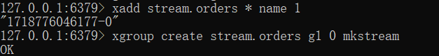

要先创建 key 才能创建相应的组


2. 

```lua
-- 1. 参数列表
-- 1.1 优惠价id
local voucherId = ARGV[1]
--1.2 用户id
local userId = ARGV[2]
-- 1.3 订单id
local orderId = ARGV[3]

-- 2. 数据key
-- 2.1 库存key拼接
local stockKey = 'seckill:stock:' .. voucherId
-- 2.2 订单id
local orderKey = 'seckill:order:' .. voucherId

-- 3. 脚本业务
-- 3.1 判断库存是否充足 redis.call 出来的是 String 用 tonumber 转数字
if (tonumber(redis.call('get', stockKey)) <= 0) then
    return 1
end
-- 3.2 判断用户是否下单
if (redis.call('sismember', orderKey, userId) == 1) then
    -- 3.3 存在 返回2
    return 2
end
-- 3.4 扣库存
redis.call('incrby', stockKey, -1)
-- 3.5 下单（保存用户）
redis.call('sadd', orderKey, userId)
-- 3.6 发送消息进消息队列中
redis.call('xadd', 'stream.orders', '*', 'userId', userId, 'voucherId', voucherId, 'id', orderId)

return 0
```


```java
private VoucherOrderController proxy;
@PostMapping("seckill/{id}")
public Result seckillVoucher(@PathVariable("id") Long voucherId) {
    //1. 执行lua脚本
    long orderId = redisIdWorker.getId("order");

    Long userId = UserHolder.getUser().getId();
    Long result = stringRedisTemplate.execute(
            SECKILL_LUA_SCRIPT,
            Collections.emptyList(),
            voucherId.toString(), userId.toString(), String.valueOf(orderId)
    );

    //2. 判断lua脚本结果
    if(result == 1L){
        return Result.fail("秒杀失败，库存不足");
    }
    if(result == 2L){
        return Result.fail("秒杀失败，不可重复下单");
    }

    //在主线程拿到代理对象
    proxy = (VoucherOrderController) AopContext.currentProxy();

    //3. 返回订单id
    return Result.ok(orderId);
}
```


3. 

```java
//线程任务
private class VoucherOrderHandler implements Runnable{
    String queueName = "stream.orders";
    @Override
    public void run() {
        while(true){
            try {
                //1. 获取消息队列中的订单信息 XREADGROUP GROUP g1 c1 COUNT 1 BLOCK 2000 STREAMS stream.orders >
                List<MapRecord<String, Object, Object>> list = stringRedisTemplate.opsForStream().read(
                        Consumer.from("g1", "c1"),
                        StreamReadOptions.empty().count(1).block(Duration.ofSeconds(2)),
                        StreamOffset.create(queueName, ReadOffset.lastConsumed())
                );

                //2. 判断消息获取是否成功
                if(list == null || list.isEmpty()){
                    continue;
                }

                //3. 获取成功，创建订单
                MapRecord<String, Object, Object> entries = list.get(0);
                Map<Object, Object> value = entries.getValue();
                VoucherOrder voucherOrder = BeanUtil.fillBeanWithMap(value, new VoucherOrder(), true);
                handleVoucherOrder(voucherOrder);

                //4. ACK 确认 XACK stream.orders g1 id
                stringRedisTemplate.opsForStream().acknowledge(queueName, "g1", entries.getId());

            } catch (Exception e) {
                log.info("处理订单异常：{}", e.getMessage());

                //handlePendingList();
            }

        }
    }
    private void handlePendingList() {
        while (true){
            try {
                //1. 获取pending-list中的订单信息 XREADGROUP GROUP g1 c1 COUNT 1 STREAMS stream.orders 0
                List<MapRecord<String, Object, Object>> list = stringRedisTemplate.opsForStream().read(
                        Consumer.from("g1", "c1"),
                        StreamReadOptions.empty().count(1),
                        StreamOffset.create(queueName, ReadOffset.from("0"))
                );

                //2. 判断消息获取是否成功
                if(list == null || list.isEmpty()){
                    break;
                }

                //3. 获取成功，创建订单
                MapRecord<String, Object, Object> entries = list.get(0);
                Map<Object, Object> value = entries.getValue();
                VoucherOrder voucherOrder = BeanUtil.fillBeanWithMap(value, new VoucherOrder(), true);
                handleVoucherOrder(voucherOrder);

                //4. ACK 确认 XACK stream.orders g1 id
                stringRedisTemplate.opsForStream().acknowledge(queueName, "g1", entries.getId());

            } catch (Exception e) {
                log.info("处理pending-list异常：{}", e.getMessage());

                try {
                    Thread.sleep(20);
                } catch (InterruptedException ex) {
                    throw new RuntimeException(ex);
                }
            }
        }
    }
}
```


**完整控制类代码：**

```java
package com.hmdp.controller;


import cn.hutool.core.bean.BeanUtil;
import com.baomidou.mybatisplus.core.conditions.query.LambdaQueryWrapper;
import com.hmdp.dto.Result;
import com.hmdp.entity.VoucherOrder;
import com.hmdp.service.ISeckillVoucherService;
import com.hmdp.service.IVoucherOrderService;
import com.hmdp.service.IVoucherService;
import com.hmdp.utils.RedisIdWorker;
import com.hmdp.utils.UserHolder;
import lombok.extern.slf4j.Slf4j;
import org.redisson.api.RLock;
import org.redisson.api.RedissonClient;
import org.springframework.aop.framework.AopContext;
import org.springframework.beans.factory.annotation.Autowired;
import org.springframework.core.io.ClassPathResource;
import org.springframework.data.redis.connection.stream.*;
import org.springframework.data.redis.core.StringRedisTemplate;
import org.springframework.data.redis.core.script.DefaultRedisScript;
import org.springframework.transaction.annotation.Transactional;
import org.springframework.web.bind.annotation.PathVariable;
import org.springframework.web.bind.annotation.PostMapping;
import org.springframework.web.bind.annotation.RequestMapping;
import org.springframework.web.bind.annotation.RestController;

import javax.annotation.PostConstruct;
import java.time.Duration;
import java.util.Collections;
import java.util.List;
import java.util.Map;
import java.util.concurrent.ArrayBlockingQueue;
import java.util.concurrent.BlockingQueue;
import java.util.concurrent.ExecutorService;
import java.util.concurrent.Executors;

/**
 * <p>
 *  前端控制器
 * </p>
 *
 * @author 虎哥
 * @since 2021-12-22
 */
@Slf4j
@RestController
@RequestMapping("/voucher-order")
public class VoucherOrderController {

    @Autowired
    private IVoucherService iVoucherService;

    @Autowired
    private ISeckillVoucherService iSeckillVoucherService;

    @Autowired
    private RedisIdWorker redisIdWorker;

    @Autowired
    private IVoucherOrderService voucherOrderService;

    @Autowired
    private StringRedisTemplate stringRedisTemplate;

    @Autowired
    private RedissonClient redissonClient;

    // 用于存放下单信息的阻塞队列，如果队列中没有对象就会被阻塞，直到有对象可以取出
    private final BlockingQueue<VoucherOrder> orderTasks = new ArrayBlockingQueue<>(1024*1024);
    //线程池
    private static final ExecutorService SECKILL_ORDER_EXECUTOR = Executors.newSingleThreadExecutor();

    //注解意思是在类初始化完成后就执行下面的方法
    @PostConstruct
    private void init(){
        SECKILL_ORDER_EXECUTOR.submit(new VoucherOrderHandler());
    }

    //线程任务
    private class VoucherOrderHandler implements Runnable{
        String queueName = "stream.orders";
        @Override
        public void run() {
            while(true){
                try {
                    //1. 获取消息队列中的订单信息 XREADGROUP GROUP g1 c1 COUNT 1 BLOCK 2000 STREAMS stream.orders >
                    List<MapRecord<String, Object, Object>> list = stringRedisTemplate.opsForStream().read(
                            Consumer.from("g1", "c1"),
                            StreamReadOptions.empty().count(1).block(Duration.ofSeconds(2)),
                            StreamOffset.create(queueName, ReadOffset.lastConsumed())
                    );

                    //2. 判断消息获取是否成功
                    if(list == null || list.isEmpty()){
                        continue;
                    }

                    //3. 获取成功，创建订单
                    MapRecord<String, Object, Object> entries = list.get(0);
                    Map<Object, Object> value = entries.getValue();
                    VoucherOrder voucherOrder = BeanUtil.fillBeanWithMap(value, new VoucherOrder(), true);
                    handleVoucherOrder(voucherOrder);

                    //4. ACK 确认 XACK stream.orders g1 id
                    stringRedisTemplate.opsForStream().acknowledge(queueName, "g1", entries.getId());

                } catch (Exception e) {
                    log.info("处理订单异常：{}", e.getMessage());

                    //handlePendingList();
                }

            }
        }
        private void handlePendingList() {
            while (true){
                try {
                    //1. 获取pending-list中的订单信息 XREADGROUP GROUP g1 c1 COUNT 1 STREAMS stream.orders 0
                    List<MapRecord<String, Object, Object>> list = stringRedisTemplate.opsForStream().read(
                            Consumer.from("g1", "c1"),
                            StreamReadOptions.empty().count(1),
                            StreamOffset.create(queueName, ReadOffset.from("0"))
                    );

                    //2. 判断消息获取是否成功
                    if(list == null || list.isEmpty()){
                        break;
                    }

                    //3. 获取成功，创建订单
                    MapRecord<String, Object, Object> entries = list.get(0);
                    Map<Object, Object> value = entries.getValue();
                    VoucherOrder voucherOrder = BeanUtil.fillBeanWithMap(value, new VoucherOrder(), true);
                    handleVoucherOrder(voucherOrder);

                    //4. ACK 确认 XACK stream.orders g1 id
                    stringRedisTemplate.opsForStream().acknowledge(queueName, "g1", entries.getId());

                } catch (Exception e) {
                    log.info("处理pending-list异常：{}", e.getMessage());

                    try {
                        Thread.sleep(20);
                    } catch (InterruptedException ex) {
                        throw new RuntimeException(ex);
                    }
                }
            }
        }
    }


    private static final DefaultRedisScript<Long> SECKILL_LUA_SCRIPT;
    static {
        SECKILL_LUA_SCRIPT = new DefaultRedisScript<>();
        SECKILL_LUA_SCRIPT.setLocation(new ClassPathResource("seckill.lua"));
        SECKILL_LUA_SCRIPT.setResultType(Long.class);
    }


    private VoucherOrderController proxy;
    @PostMapping("seckill/{id}")
    public Result seckillVoucher(@PathVariable("id") Long voucherId) {
        //在主线程拿到代理对象
        proxy = (VoucherOrderController) AopContext.currentProxy();

        //1. 执行lua脚本
        long orderId = redisIdWorker.getId("order");

        Long userId = UserHolder.getUser().getId();
        Long result = stringRedisTemplate.execute(
                SECKILL_LUA_SCRIPT,
                Collections.emptyList(),
                voucherId.toString(), userId.toString(), String.valueOf(orderId)
        );

        //2. 判断lua脚本结果
        if(result == 1L){
            return Result.fail("秒杀失败，库存不足");
        }
        if(result == 2L){
            return Result.fail("秒杀失败，不可重复下单");
        }


        //3. 返回订单id
        return Result.ok(orderId);
    }


    @Transactional
    public void createVoucherOrder(long voucherId, long userId) {
            //一人一单
            LambdaQueryWrapper<VoucherOrder> lambdaQueryWrapper1 = new LambdaQueryWrapper<>();
            lambdaQueryWrapper1.eq(VoucherOrder::getUserId, userId);

            List<VoucherOrder> voucherOrders = voucherOrderService.list(lambdaQueryWrapper1);

            if (!voucherOrders.isEmpty()) {
                log.info("用户已经下过单了");
                return;
            }


            // 扣库存
            boolean b = iSeckillVoucherService.update()
                    .setSql("stock = stock - 1")
                    .eq("voucher_id", voucherId)
                    .gt("stock", 0)
                    .update();

            if (!b) {
                log.info("抢卷失败，库存不足");
                return;
            }

            VoucherOrder voucherOrder = new VoucherOrder();
            long orderId = redisIdWorker.getId("voucher_order");
            voucherOrder.setId(orderId);
            voucherOrder.setVoucherId(voucherId);
            voucherOrder.setUserId(userId);

            voucherOrderService.save(voucherOrder);

    }


    public void handleVoucherOrder(VoucherOrder voucherOrder) {
        //因为现在是多线程，没办法从UserHolder拿id
        Long userId = voucherOrder.getUserId();

        RLock lock = redissonClient.getLock("lock:order:" + userId);

        if (!lock.tryLock()) {
            log.info("不允许重复下单");
            return;
        }
        try {
            //没办法在这里从AopContext.currentProxy()拿代理对象，因为这个方法是基于ThreadLocal做的
            //VoucherOrderController proxy = (VoucherOrderController) AopContext.currentProxy();
            proxy.createVoucherOrder(voucherOrder.getVoucherId(), userId);
        }catch (Exception e){
            log.info("抢卷失败，请稍后再试");
        }
        finally {
            lock.unlock();
        }
    }
}
```


## 4.6 达人探店

### 4.6.1 点赞功能实现


1. 

```java
/**
 * 是否点赞过了
 */
@TableField(exist = false)
private Boolean isLike;
```


2. 

```java
@PutMapping("/like/{id}")
public Result likeBlog(@PathVariable("id") Long id) {
    //1. 获取当前登录用户
    Long userId = UserHolder.getUser().getId();

    //2. 判断当前用户是否点赞
    Boolean member = stringRedisTemplate.opsForSet().isMember(LIKE_KEY + id, userId.toString());

    //3. 如果未点赞
    if(BooleanUtil.isFalse(member)) {
        //3.1 数据库点赞数+1
        LambdaUpdateWrapper<Blog> lambdaUpdateWrapper =  new LambdaUpdateWrapper<>();
        lambdaUpdateWrapper.eq(Blog::getId, id);
        Blog blog = blogService.getOne(lambdaUpdateWrapper);

        blog.setLiked(blog.getLiked() + 1);

        boolean ifSuccess = blogService.update(blog, lambdaUpdateWrapper);

        if(BooleanUtil.isTrue(ifSuccess)){
            //3.2 保存用户到redis集合
            stringRedisTemplate.opsForSet().add(LIKE_KEY + id, userId.toString());
        }
    }else {
        //4. 如果已点赞，取消点赞
        //4.1 数据库点赞数-1
        LambdaUpdateWrapper<Blog> lambdaUpdateWrapper = new LambdaUpdateWrapper<>();
        lambdaUpdateWrapper.eq(Blog::getId, id);
        Blog blog = blogService.getOne(lambdaUpdateWrapper);

        blog.setLiked(blog.getLiked() - 1);

        boolean ifSuccess = blogService.update(blog, lambdaUpdateWrapper);

        if (BooleanUtil.isTrue(ifSuccess)) {
            //4.2 redis集合删除用户
            stringRedisTemplate.opsForSet().remove(LIKE_KEY + id, userId.toString());
        }

    }
    return Result.ok();
}
```


3. 

```java
@Transactional
@GetMapping("/{id}")
public Result queryBlogById(@PathVariable Long id){
    LambdaQueryWrapper<Blog> lambdaQueryWrapper = new LambdaQueryWrapper<>();
    lambdaQueryWrapper.eq(Blog::getId, id);
    Blog blog = blogService.getOne(lambdaQueryWrapper);

    if (blog == null) {
        return Result.fail("博文不存在");
    }

    User user = userService.getById(blog.getUserId());
    blog.setName(user.getNickName());
    blog.setIcon(user.getIcon());

    isBlogBeLike(blog);

    return Result.ok(blog);
}
```

```java
private void isBlogBeLike(Blog blog) {
    //1. 获取当前登录用户
    Long userId = UserHolder.getUser().getId();

    //2. 判断当前用户是否点赞
    Boolean member = stringRedisTemplate.opsForSet().isMember(LIKE_KEY + blog.getId(), userId.toString());

    blog.setIsLike(BooleanUtil.isTrue(member));
}
```


4. 

```java
@GetMapping("/hot")
public Result queryHotBlog(@RequestParam(value = "current", defaultValue = "1") Integer current) {
    // 根据用户查询
    Page<Blog> page = blogService.query()
            .orderByDesc("liked")
            .page(new Page<>(current, SystemConstants.MAX_PAGE_SIZE));
    // 获取当前页数据
    List<Blog> records = page.getRecords();
    // 查询用户
    records.forEach(blog ->{
        Long userId = blog.getUserId();
        User user = userService.getById(userId);
        blog.setName(user.getNickName());
        blog.setIcon(user.getIcon());

        isBlogBeLike(blog);
    });
    return Result.ok(records);
}
```


### 4.6.2 点赞排行榜（在 blog 展示给该 blog 点赞的用户）


因为是要按点赞时间排序，所以改用zset


```java
package com.hmdp.controller;


import cn.hutool.core.util.BooleanUtil;
import com.baomidou.mybatisplus.core.conditions.query.LambdaQueryWrapper;
import com.baomidou.mybatisplus.core.conditions.update.LambdaUpdateWrapper;
import com.baomidou.mybatisplus.extension.plugins.pagination.Page;
import com.hmdp.dto.Result;
import com.hmdp.dto.UserDTO;
import com.hmdp.entity.Blog;
import com.hmdp.entity.User;
import com.hmdp.service.IBlogService;
import com.hmdp.service.IUserService;
import com.hmdp.utils.SystemConstants;
import com.hmdp.utils.UserHolder;
import org.springframework.beans.BeanUtils;
import org.springframework.data.redis.core.StringRedisTemplate;
import org.springframework.transaction.annotation.Transactional;
import org.springframework.web.bind.annotation.*;

import javax.annotation.Resource;
import java.time.LocalDateTime;
import java.util.ArrayList;
import java.util.List;
import java.util.Set;
import java.util.stream.Collectors;

/**
 * <p>
 * 前端控制器
 * </p>
 *
 * @author 虎哥
 * @since 2021-12-22
 */
@RestController
@RequestMapping("/blog")
public class BlogController {

    private static final String LIKE_KEY = "blog:like:";

    @Resource
    private IBlogService blogService;
    @Resource
    private IUserService userService;
    @Resource
    private StringRedisTemplate stringRedisTemplate;

    @PostMapping
    public Result saveBlog(@RequestBody Blog blog) {
        // 获取登录用户
        UserDTO user = UserHolder.getUser();
        blog.setUserId(user.getId());
        // 保存探店博文
        blogService.save(blog);
        // 返回id
        return Result.ok(blog.getId());
    }

    @PutMapping("/like/{id}")
    public Result likeBlog(@PathVariable("id") Long id) {
        String key = LIKE_KEY + id;
        //1. 获取当前登录用户
        Long userId = UserHolder.getUser().getId();

        //2. 判断当前用户是否点赞
        Double member = stringRedisTemplate.opsForZSet().score(key, userId.toString());

        //3. 如果未点赞
        if(member == null) {
            //3.1 数据库点赞数+1
            LambdaUpdateWrapper<Blog> lambdaUpdateWrapper =  new LambdaUpdateWrapper<>();
            lambdaUpdateWrapper.eq(Blog::getId, id);
            Blog blog = blogService.getOne(lambdaUpdateWrapper);

            blog.setLiked(blog.getLiked() + 1);

            boolean ifSuccess = blogService.update(blog, lambdaUpdateWrapper);

            if(BooleanUtil.isTrue(ifSuccess)){
                //3.2 保存用户到redis集合
                stringRedisTemplate.opsForZSet().add(LIKE_KEY + id, userId.toString(), System.currentTimeMillis());
            }
        }else {
            //4. 如果已点赞，取消点赞
            //4.1 数据库点赞数-1
            LambdaUpdateWrapper<Blog> lambdaUpdateWrapper = new LambdaUpdateWrapper<>();
            lambdaUpdateWrapper.eq(Blog::getId, id);
            Blog blog = blogService.getOne(lambdaUpdateWrapper);

            blog.setLiked(blog.getLiked() - 1);

            boolean ifSuccess = blogService.update(blog, lambdaUpdateWrapper);

            if (BooleanUtil.isTrue(ifSuccess)) {
                //4.2 redis集合删除用户
                stringRedisTemplate.opsForZSet().remove(LIKE_KEY + id, userId.toString());
            }

        }
        return Result.ok();
    }

    @GetMapping("/of/me")
    public Result queryMyBlog(@RequestParam(value = "current", defaultValue = "1") Integer current) {
        // 获取登录用户
        UserDTO user = UserHolder.getUser();
        // 根据用户查询
        Page<Blog> page = blogService.query()
                .eq("user_id", user.getId()).page(new Page<>(current, SystemConstants.MAX_PAGE_SIZE));
        // 获取当前页数据
        List<Blog> records = page.getRecords();
        return Result.ok(records);
    }

    @GetMapping("/hot")
    public Result queryHotBlog(@RequestParam(value = "current", defaultValue = "1") Integer current) {
        // 根据用户查询
        Page<Blog> page = blogService.query()
                .orderByDesc("liked")
                .page(new Page<>(current, SystemConstants.MAX_PAGE_SIZE));
        // 获取当前页数据
        List<Blog> records = page.getRecords();
        // 查询用户
        records.forEach(blog ->{
            Long userId = blog.getUserId();
            User user = userService.getById(userId);
            blog.setName(user.getNickName());
            blog.setIcon(user.getIcon());

            isBlogBeLike(blog);
        });
        return Result.ok(records);
    }


    @Transactional
    @GetMapping("/{id}")
    public Result queryBlogById(@PathVariable Long id){
        LambdaQueryWrapper<Blog> lambdaQueryWrapper = new LambdaQueryWrapper<>();
        lambdaQueryWrapper.eq(Blog::getId, id);
        Blog blog = blogService.getOne(lambdaQueryWrapper);

        if (blog == null) {
            return Result.fail("博文不存在");
        }

        User user = userService.getById(blog.getUserId());
        blog.setName(user.getNickName());
        blog.setIcon(user.getIcon());

        isBlogBeLike(blog);

        return Result.ok(blog);
    }

    private void isBlogBeLike(Blog blog) {
        String key = LIKE_KEY + blog.getId();
        //1. 获取当前登录用户
        UserDTO user = UserHolder.getUser();

        if(user == null){
            return;
        }

        Long userId = user.getId();

        //2. 判断当前用户是否点赞
        Double member = stringRedisTemplate.opsForZSet().score(key, userId.toString());

        blog.setIsLike(member != null);
    }


    @GetMapping("/likes/{id}")
    public Result queryBlogLikes(@PathVariable Long id){
        Set<String> range = stringRedisTemplate.opsForZSet().range(LIKE_KEY + id, 0, 4);

        if (range == null || range.isEmpty()) {
            return Result.ok();
        }

        List<Long> collect = range.stream().map(Long::valueOf).collect(Collectors.toList());


        //因为直接用listById查的sql用的是in，导致用户是按id排序展示的，所以用query拼接字符串自定义排序
        //where id in (5, 1) order by field(id, 5 ,1)
        List<User> users = userService.query().
                in("id", collect).
                last("ORDER BY FIELD(id," +
                        collect.stream().map(Object::toString).collect(Collectors.joining(","))
                        + ")")
                .list();

        List<UserDTO> userDTOS = new ArrayList<>();

        for(User user : users){
            UserDTO userDTO = new UserDTO();
            BeanUtils.copyProperties(user, userDTO);

            userDTOS.add(userDTO);
        }

        return Result.ok(userDTOS);
    }

}
```


注意到 queryBlogLikes 方法中的

```java
List<Long> collect = range.stream().map(Long::valueOf).collect(Collectors.toList());


//因为直接用listById查的sql用的是in，导致用户是按id排序展示的，所以用query拼接字符串自定义排序
//where id in (5, 1) order by field(id, 5 ,1)
List<User> users = userService.query().
        in("id", collect).
        last("ORDER BY FIELD(id," +
                collect.stream().map(Object::toString).collect(Collectors.joining(","))
                + ")")
        .list();
```

需要自定义sql


## 4.7 好友关注

### 4.7.1 关注与取关

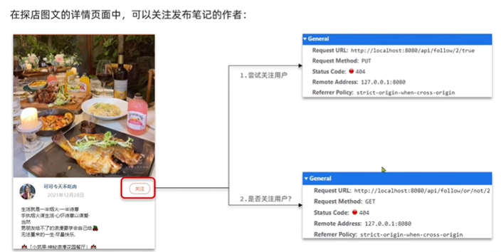

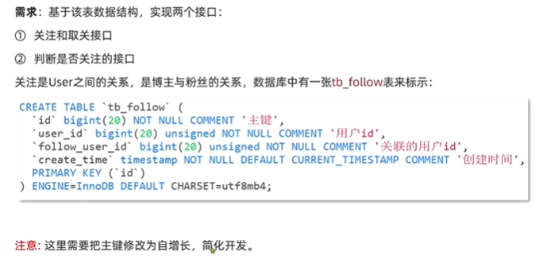


```java
package com.hmdp.controller;


import com.baomidou.mybatisplus.core.conditions.query.LambdaQueryWrapper;
import com.hmdp.dto.Result;
import com.hmdp.entity.Follow;
import com.hmdp.service.IFollowService;
import com.hmdp.utils.UserHolder;
import org.springframework.beans.factory.annotation.Autowired;
import org.springframework.web.bind.annotation.*;

/**
 * <p>
 *  前端控制器
 * </p>
 *
 * @author 虎哥
 * @since 2021-12-22
 */
@RestController
@RequestMapping("/follow")
public class FollowController {

    @Autowired
    private IFollowService followService;

    @PutMapping("/{id}/{isFollower}")
    public Result follower(@PathVariable Long id, @PathVariable Boolean isFollower){
        Long userId = UserHolder.getUser().getId();

        if(isFollower){
            Follow follow = new Follow();
            follow.setUserId(userId);
            follow.setFollowUserId(id);

            followService.save(follow);

        }else {
            LambdaQueryWrapper<Follow> lambdaQueryWrapper = new LambdaQueryWrapper<>();
            lambdaQueryWrapper.eq(Follow::getUserId,userId);
            lambdaQueryWrapper.eq(Follow::getFollowUserId,id);

            followService.remove(lambdaQueryWrapper);

        }

        return Result.ok();
    }


    @GetMapping("/or/not/{id}")
    public Result follower(@PathVariable Long id){
        Long userId = UserHolder.getUser().getId();

        LambdaQueryWrapper<Follow> lambdaQueryWrapper = new LambdaQueryWrapper<>();
        lambdaQueryWrapper.eq(Follow::getUserId,userId);
        lambdaQueryWrapper.eq(Follow::getFollowUserId,id);

        Follow one = followService.getOne(lambdaQueryWrapper);

        if(one == null){
            return Result.ok(false);
        }

        return Result.ok(true);
    }
}
```


### 4.7.2 共同关注

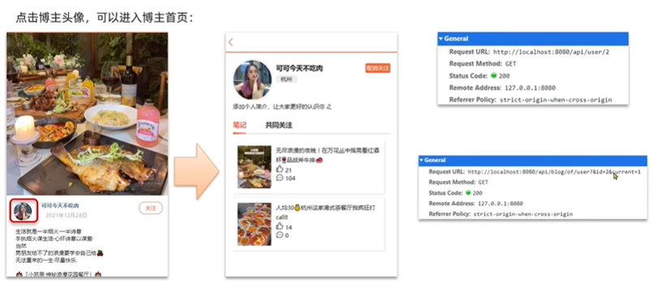

```java
@PutMapping("/{id}/{isFollower}")
public Result follower(@PathVariable Long id, @PathVariable Boolean isFollower){
    Long userId = UserHolder.getUser().getId();

    if(isFollower){
        Follow follow = new Follow();
        follow.setUserId(userId);
        follow.setFollowUserId(id);

        boolean isSuccess = followService.save(follow);

        if(isSuccess){
            stringRedisTemplate.opsForSet().add("follow:"+userId, id.toString());
        }

    }else {
        LambdaQueryWrapper<Follow> lambdaQueryWrapper = new LambdaQueryWrapper<>();
        lambdaQueryWrapper.eq(Follow::getUserId,userId);
        lambdaQueryWrapper.eq(Follow::getFollowUserId,id);

        boolean ifSuccess = followService.remove(lambdaQueryWrapper);

        if(ifSuccess){
            stringRedisTemplate.opsForSet().remove("follow:"+userId, id.toString());
        }

    }

    return Result.ok();
}
```

```java
@GetMapping("/common/{id}")
public Result followCommons(@PathVariable Long id){
    Long userId = UserHolder.getUser().getId();

    //求set交集
    Set<String> intersect = stringRedisTemplate.opsForSet().intersect("follow:" + userId, "follow:" + id);

    //解析出Long型id
    if (intersect == null || intersect.isEmpty()) {
        return Result.ok(Collections.emptyList());
    }

    List<Long> collect = intersect.stream().map(Long::valueOf).collect(Collectors.toList());

    List<User> users = userService.listByIds(collect);
    List<UserDTO> userDTOS = new ArrayList<>();

    for (User user : users) {
        UserDTO userDTO = new UserDTO();
        BeanUtils.copyProperties(user, userDTO);
        userDTOS.add(userDTO);
    }

    return Result.ok(userDTOS);
}
```

将关注信息以 （key = userId ， value = userFollowId）的形式存进 redis

查找共同用户的时候就查交集

```java
stringRedisTemplate.opsForSet().intersect("follow:" + userId, "follow:" + id);
```


### 4.7.3 关注推送

#### 4.7.3.1 Feed 流实现方案推送

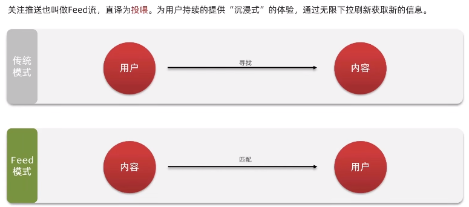

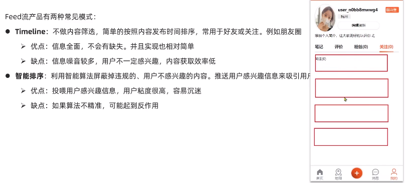

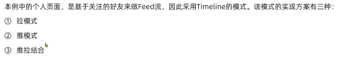


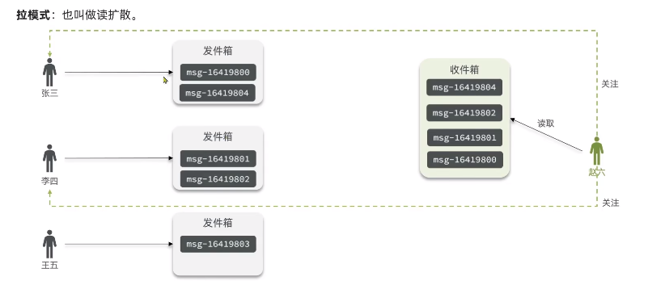

优点：节省内存空间

缺点：每次读取都要拉一次，延迟高


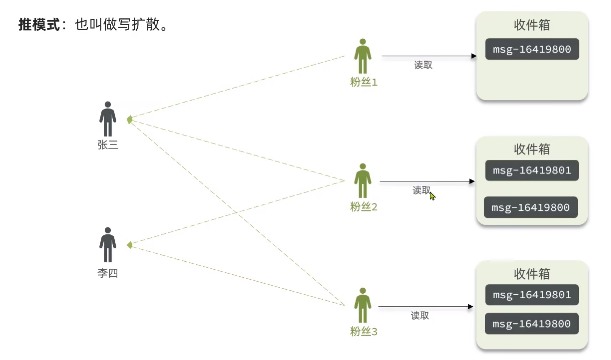

优点：延迟低

缺点：一个消息要写n遍，内存占用高


普通up采用推模式

大v对活跃粉丝使用推模式，对普通粉丝使用拉模式


#### 4.7.3.2 基于推模式实现关注推送功能


会导致重复读取


所以虽然 list 和 sortedset 都能实现分页查询，但是只有 sortedset 能实现滚动分页查询


发布笔记推送到粉丝收件箱（基于 zset 实现）：

```java
@PostMapping
public Result saveBlog(@RequestBody Blog blog) {
    // 获取登录用户
    UserDTO user = UserHolder.getUser();
    blog.setUserId(user.getId());
    // 保存探店博文
    boolean ifSuccess = blogService.save(blog);

    if(BooleanUtil.isFalse(ifSuccess)){
        return Result.fail("保存失败");
    }


    //查询所有粉丝
    LambdaQueryWrapper<Follow> lambdaQueryWrapper = new LambdaQueryWrapper<>();
    lambdaQueryWrapper.eq(Follow::getFollowUserId, user.getId());
    List<Follow> fanList = followService.list(lambdaQueryWrapper);

    if(fanList == null || fanList.isEmpty()){
        return Result.ok(blog.getId());
    }

    //将blog推给所有粉丝
    for(Follow follow : fanList){
        String key = "feed:" + follow.getUserId();

        stringRedisTemplate.opsForZSet().add(key, blog.getId().toString(), System.currentTimeMillis());
    }

    // 返回id
    return Result.ok(blog.getId());
}
```


以下用的都是闭区间

ZREVRANGEBYSCORE --> 按 分数 降序 查找

keyName --> set 名称

max min --> 查找的分数最大最小值

WITHSCORES --> 是否带着分数查找出来

OFFSET --> 偏移量（0就是从 max 开始，1就是从 max 后一个开始，以此类推）

COUNT --> 查几条

```redis
ZREVRANGEBYSCORE keyName max min [WITHSCORES] [LIMIT OFFSET COUNT]
```

一般来说 min 、count 是写死的

max 取上次的最小值（如果是第一次取最大值-当前时间戳）

offset 取上次最小值的个数（如果写死为1，可能会导致存在多个最小时间戳相同的数据，只跳过一个就会导致重复读的问题）（如果第一次，取0）


**滚动查询业务代码：**

```java
@GetMapping("/of/follow")
public Result queryBlogOfFollow(@RequestParam("lastId") Long max, @RequestParam(value = "offset", defaultValue = "0") Integer offset){
    Long userId = UserHolder.getUser().getId();

    //1. 查询收件箱
    String key = "feed:" + userId;
    Set<ZSetOperations.TypedTuple<String>> typedTuples = stringRedisTemplate.opsForZSet()
            .reverseRangeByScoreWithScores(key, 0, max, offset, 2);

    if(typedTuples == null || typedTuples.isEmpty()){
        return Result.ok();
    }

    //2. 解析数据：blogId、minTime、offset
    List<Long> ids = new ArrayList<>(typedTuples.size());
    long minTime = 0L;
    int offsetGetFromRedis = 1;
    for(ZSetOperations.TypedTuple<String> typedTuple : typedTuples){
        String blogId = typedTuple.getValue();
        if (blogId != null) {
            ids.add(Long.valueOf(blogId));
        }

        long time = Objects.requireNonNull(typedTuple.getScore()).longValue();
        if(time == minTime){
            offsetGetFromRedis += 1;
        }else {
            minTime = time;
            offsetGetFromRedis = 1;
        }

    }

    //3. 根据id查blog
    //List<Blog> blogs = blogService.listByIds(ids);不能这样查
    //因为这样用的是in查询，顺序乱了
    List<Blog> blogs = new ArrayList<>(ids.size());
    for(Long id : ids){
        Blog blog = blogService.getById(id);

        if(blog != null){
            User user = userService.getById(blog.getUserId());
            blog.setName(user.getNickName());
            blog.setIcon(user.getIcon());

            isBlogBeLike(blog);

            blogs.add(blog);
        }
    }

    //4. 封装返回
    ScrollResult scrollResult = new ScrollResult();
    scrollResult.setList(blogs);
    scrollResult.setOffset(offsetGetFromRedis);
    scrollResult.setMinTime(minTime);

    return Result.ok(scrollResult);
}
```


## 4.8 附近商户

### 4.8.1 GEO 数据结构

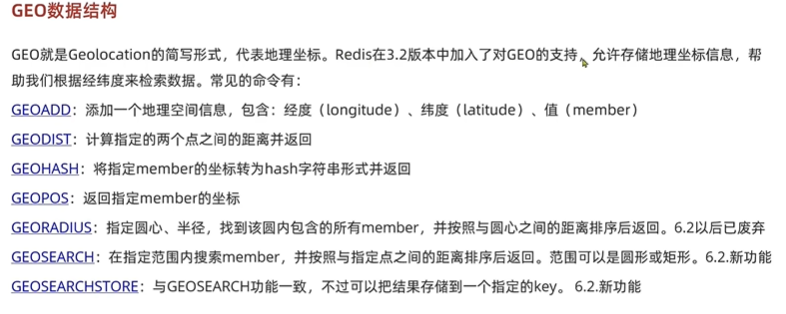

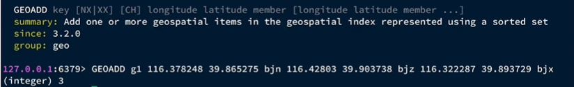

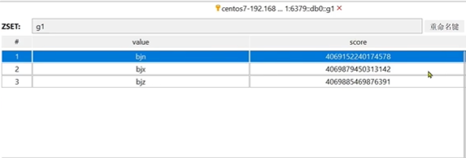

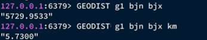

GEODIST 默认单位是 m ，可以指定单位


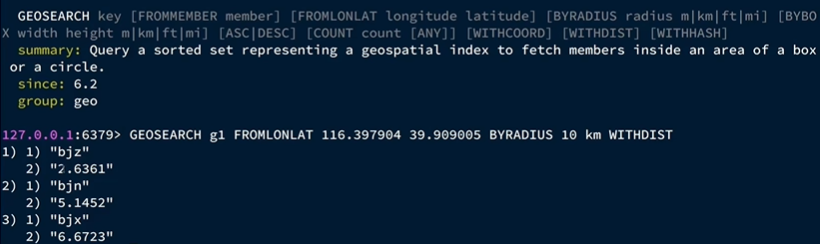

默认升序


### 4.8.2 实现基于 GEO 的附近商铺功能

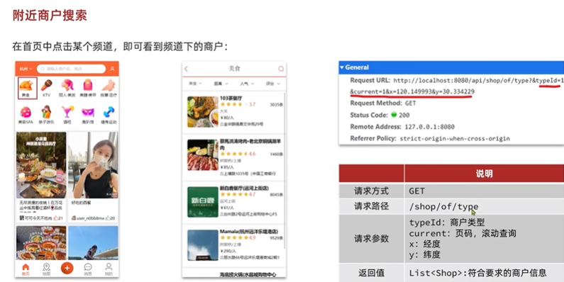

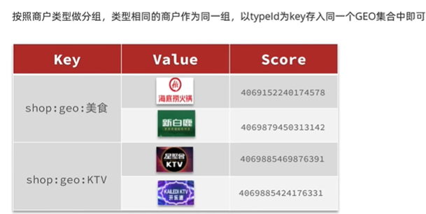


添加商铺信息进 redis ：

```java
@Test
public void loadShopData(){
    //1. 获取所有商铺信息
    List<Shop> shopList = shopService.list();

    //2. 根据key：商铺类型，value：所属商铺list，转成map
    Map<Long, List<Shop>> shopMap = shopList
            .stream().collect(
                    Collectors.groupingBy(Shop::getTypeId)
            );

    //3. 存进redis
    for(Map.Entry<Long, List<Shop>> entry : shopMap.entrySet()){
        Long typeId = entry.getKey();
        String key = "shop:geo:" + typeId;

        List<Shop> value = entry.getValue();
        List<RedisGeoCommands.GeoLocation<String>> locations = new ArrayList<>(shopList.size());

        //这样就之用向redis发一次请求
        for (Shop shop : value) {
            //stringRedisTemplate.opsForGeo().add(key, new Point(shop.getX(), shop.getY()), shop.getId().toString());
            locations.add(new RedisGeoCommands.GeoLocation<>(
                    shop.getId().toString(),
                    new Point(shop.getX(), shop.getY())
            ));
        }

        stringRedisTemplate.opsForGeo().add(key, locations);
    }


}
```


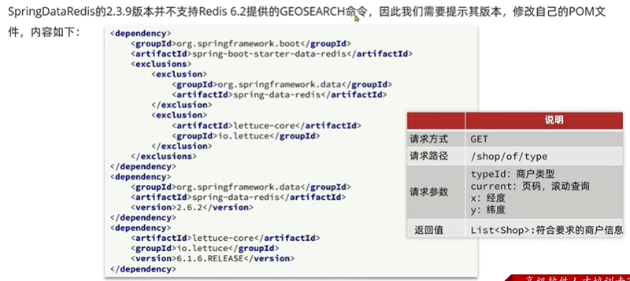

```xml
<dependencies>
    <dependency>
        <groupId>org.springframework.boot</groupId>
        <artifactId>spring-boot-starter-data-redis</artifactId>
            <exclusions>
                <exclusion>
                    <groupId>org.springframework.data</groupId>
                    <artifactId>spring-aop-redis</artifactId>
                </exclusion>
                <exclusion>
                    <artifactId>lettuce-core</artifactId>
                    <groupId>io.lettuce</groupId>
                </exclusion>
            </exclusions>
    </dependency>

    <dependency>
        <groupId>org.springframework.data</groupId>
        <artifactId>spring-data-redis</artifactId>
        <version>2.6.2</version>
    </dependency>

    <dependency>
        <artifactId>lettuce-core</artifactId>
        <groupId>io.lettuce</groupId>
        <version>6.1.6.RELEASE</version>
    </dependency>
```


**业务代码：**

```java
/**
 * 根据商铺类型分页查询商铺信息
 * @param typeId 商铺类型
 * @param current 页码
 * @return 商铺列表
 */
@GetMapping("/of/type")
public Result queryShopByType(
        @RequestParam("typeId") Integer typeId,
        @RequestParam(value = "current", defaultValue = "1") Integer current,
        @RequestParam(value = "x", required = false) Double x,
        @RequestParam(value = "y", required = false) Double y

) {
    //如果前端没有传xy，用默认查询
    if(x == null || y == null) {
        // 根据类型分页查询
        Page<Shop> page = shopService.query()
                .eq("type_id", typeId)
                .page(new Page<>(current, SystemConstants.DEFAULT_PAGE_SIZE));
        // 返回数据
        return Result.ok(page.getRecords());
    }

    //算出分页查询需要的from（从哪开始）和end（从哪结束）
    int from = (current - 1) * SystemConstants.DEFAULT_PAGE_SIZE;
    int end = current * SystemConstants.DEFAULT_PAGE_SIZE;

    //从redis中查出5公里内的商铺
    //GEOSEARCH key BYLONLAT x y BYRADIUS 5 km WITHDISTANCE
    GeoResults<RedisGeoCommands.GeoLocation<String>> results = stringRedisTemplate.opsForGeo()
            .search(
                    "shop:geo:" + typeId,
                    GeoReference.fromCoordinate(x, y),
                    new Distance(5000),
                    RedisGeoCommands.GeoSearchCommandArgs.newGeoSearchArgs().includeDistance().limit(end)
            );

    //判断是否为空
    if(results == null){
        return Result.ok(Collections.emptyList());
    }


    List<GeoResult<RedisGeoCommands.GeoLocation<String>>> content = results.getContent();
    List<Long> ids = new ArrayList<>(content.size());
    Map<String, Distance> distanceMap = new HashMap<>(content.size());

    //查出的results如果长度小于from，意味着已经查到底了，直接返回就行
    if(content.size() <= from){
        return Result.ok(Collections.emptyList());
    }

    //如果正常就把result里的东西拿出塞进ids和shopList
    content.stream().skip(from).forEach(result -> {
        String shopId = result.getContent().getName();
        ids.add(Long.valueOf(shopId));

        Distance distance = result.getDistance();
        distanceMap.put(shopId, distance);
    });

    //按距离排好的顺序查询并设置好距离返回
    List<Shop> shopList = new ArrayList<>(ids.size());
    for (Long id : ids) {
        Shop shop = shopService.getById(id);
        shop.setDistance(distanceMap.get(id.toString()).getValue());

        shopList.add(shop);
    }

    return Result.ok(shopList);
}
```


## 4.9 用户签到

### 4.9.1 Redis 的 BitMap 用法

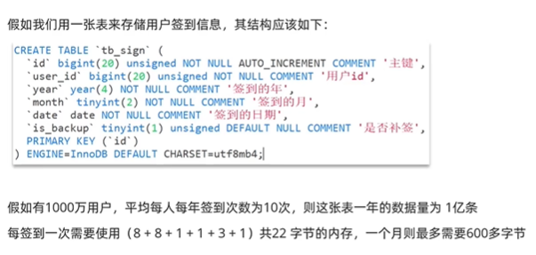

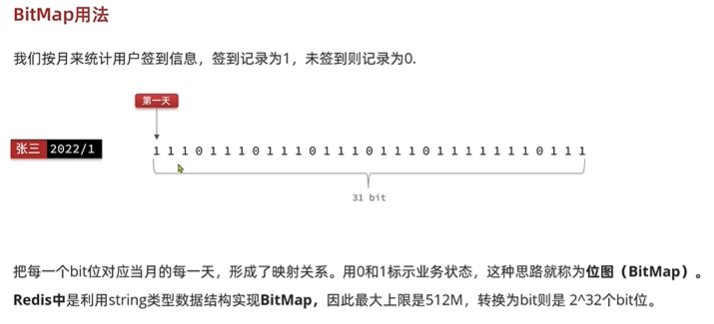


### 4.9.2 功能实现

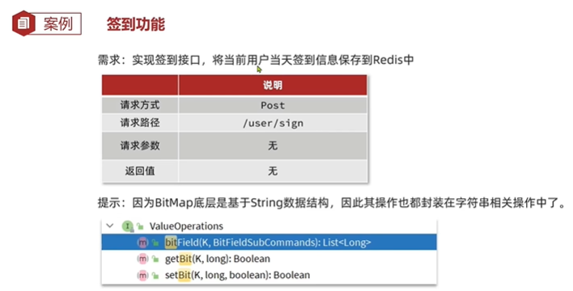


```java
@PostMapping("/sign")
public Result sign(){
    Long userId = UserHolder.getUser().getId();

    //获取日期
    LocalDateTime now = LocalDateTime.now();
    String yyyyMM = now.format(DateTimeFormatter.ofPattern(":yyyyMM"));

    String key = "sign:" + userId + yyyyMM;

    int dayOfMonth = now.getDayOfMonth() - 1;

    stringRedisTemplate.opsForValue().setBit(key, dayOfMonth, true);

    return Result.ok();
}
```


### 4.9.3 签到统计


```redis
BITFIELD sign:userId:yyyMM GET u今天几号 0
```

```java
//获取本月截止今天为止的所有签到记录，返回的是十进制
//BITFIELD sign:userId:yyyMM GET u今天几号 0
List<Long> results = stringRedisTemplate.opsForValue().bitField(
        key,
        BitFieldSubCommands.create()
                .get(BitFieldSubCommands.BitFieldType.unsigned(dayOfMonth)).valueAt(0),

        );
```


## 4.10 UV（独立访客量）统计


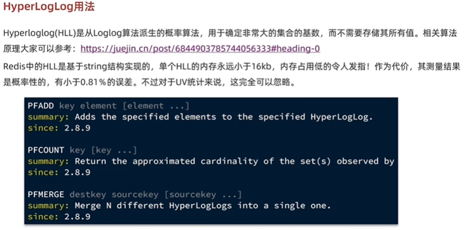

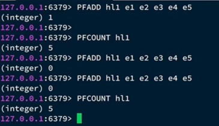

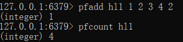

重复值在 pfcount 的时候忽略，所以天然的适合做唯一性检验


### 4.10.1 实现 UV（百万级别数据量）统计

```java
@Test
public void testHyperLoglog(){
    String[] users = new String[1000];

    int index = 0;
    for(int i = 0; i < 1000000; i++){
        users[index++] = "user_" + i;

        if(i % 1000 == 999){
            index = 0;
            stringRedisTemplate.opsForHyperLogLog().add("hll1", users);
        }
    }

    Long size = stringRedisTemplate.opsForHyperLogLog().size("hll1");
    System.out.println("size = " + size);

}
```


结果：

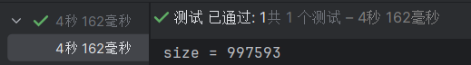

误差：0.25%


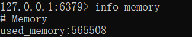

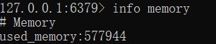

前后内存占用：

（565508 - 577944）/ 1024 = 12.14kb


